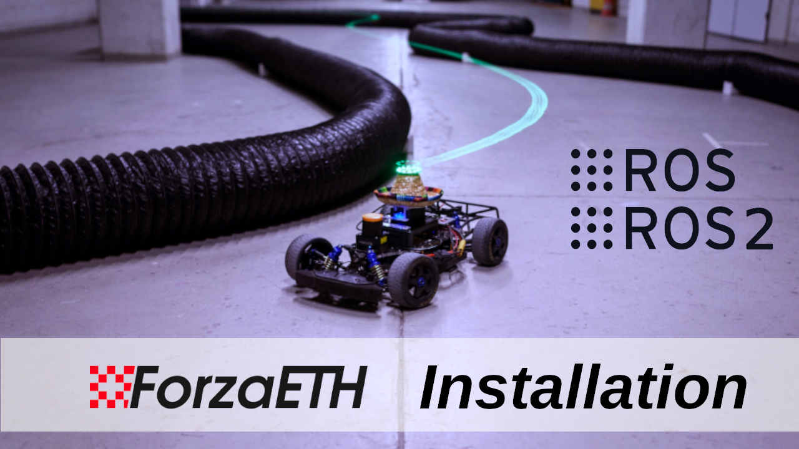
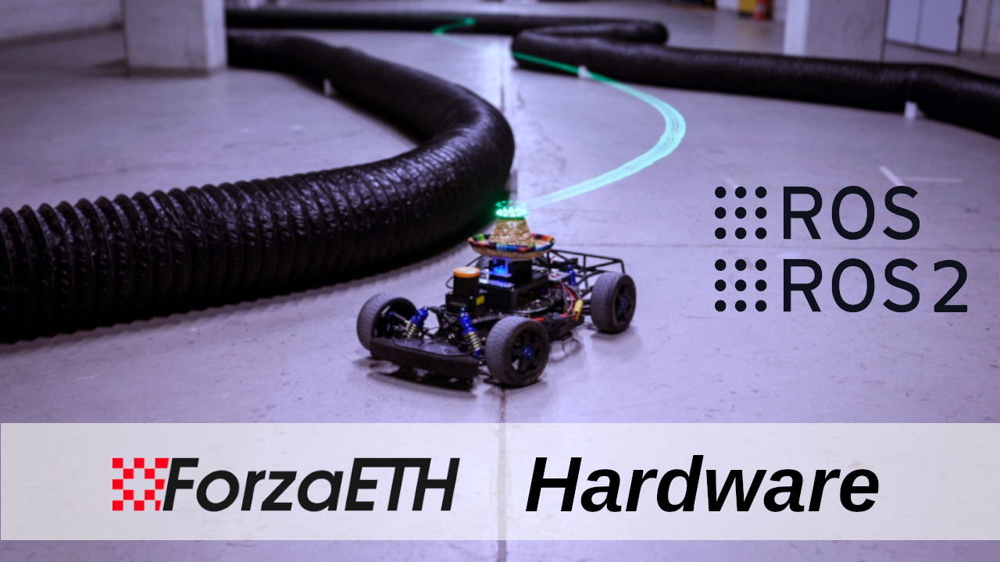

# ROS 2 ForzaETH Race Stack at Center for Project Based Learning

<a href="https://arxiv.org/abs/2403.11784">
    
</a>

ForzaETH Race Stack by the [D-ITET Center for Project Based Learning (PBL)](https://pbl.ee.ethz.ch/) at ETH Zurich. 

Accompanying this repository, a paper titled *ForzaETH Race Stack - Scaled Autonomous Head-to-Head Racing on Fully Commercial off-the-Shelf Hardware* is available on [Journal of Field Robotics](https://onlinelibrary.wiley.com/doi/pdf/10.1002/rob.22429), detailing the system's architecture, algorithms, and performance benchmarks.

**Note:** The results in the paper have been evaluated in the ROS1 version of the stack. As this is the ROS 2 version of the ForzaETH Race Stack, results may differ, as well as certain functionalities might be **missing** such as (might be added in the future):
- Baysian Optimization
- CPU Usage Measurements
- Car2Car Syncing
- SynPF integration
- Scan Alignment
- System Identification

**Note:** In general the ROS 2 stack is significantly less tested and explored than the ROS 1 version!

## Installation

We provide an installation guide [here](.docker_utils/README.md). 

Or check out our [video playlist on Youtube](https://www.youtube.com/playlist?list=PLMzSGo5LtaW9cgdwHB_FnX3qlAYx7P6JI):  
<a href="https://www.youtube.com/watch?v=A9Clg1n6rII">
  
</a>
<a href="https://www.youtube.com/watch?v=6PtFzrRz1GU">
  
</a>
<a href="https://www.youtube.com/watch?v=ACQdLD27v-k">
  
</a>

**Note:** Click on the thumbnails to watch the videos.

## Getting started

After installation, the car (or the simulation environment) is ready to be tested. For examples on how to run the different modules on the car, refer to the [`stack_master` README](./stack_master/README.md).

## Contributing

In case you find our package helpful and want to contribute, please either raise an issue or directly make a pull request. To create pull request please follow the guidelines in [CONTRIBUTING](./CONTRIBUTING.md).

## Acknowledgement
This project would not be possible without the use of multiple great open-sourced code bases as listed below:

- [f1tenth_system](https://github.com/f1tenth/f1tenth_system)
- [F1TENTH Racecar Simulator](https://github.com/f1tenth/f1tenth_simulator)
- [Veddar VESC Interface](https://github.com/f1tenth/vesc)
- [Cartographer](https://github.com/cartographer-project/cartographer)
- [Cartographer ROS Integration](https://github.com/cartographer-project/cartographer_ros)
- [global_racetrajectory_optimization](https://github.com/TUMFTM/global_racetrajectory_optimization)
- [RangeLibc](https://github.com/kctess5/range_libc)
- [BayesOpt4ROS](https://github.com/IntelligentControlSystems/bayesopt4ros)
- [cpu_monitor](https://github.com/alspitz/cpu_monitor)

### Problems
If you are having problem with the SIM (no car/scans showing for example), try the setup once again:
```bash
source ~/ws/src/race_stack/.install_utils/f110_sim_setup.sh
```

If your joystick is not working, try the following while the controller is connected:
```bash
sudo chmod 666 /dev/input/js0
sudo chmod 666 /dev/input/event*
```

## Citing ForzaETH Race Stack

If you found our race stack helpful in your research, we would appreciate if you cite it as follows:
```
@article{baumann2024forzaeth,
  title={ForzaETH Race Stack—Scaled Autonomous Head-to-Head Racing on Fully Commercial Off-the-Shelf Hardware},
  author={Baumann, Nicolas and Ghignone, Edoardo and K{\"u}hne, Jonas and Bastuck, Niklas and Becker, Jonathan and Imholz, Nadine and Kr{\"a}nzlin, Tobias and Lim, Tian Yi and L{\"o}tscher, Michael and Schwarzenbach, Luca and others},
  journal={Journal of Field Robotics},
  year={2024},
  publisher={Wiley Online Library}
}
```
