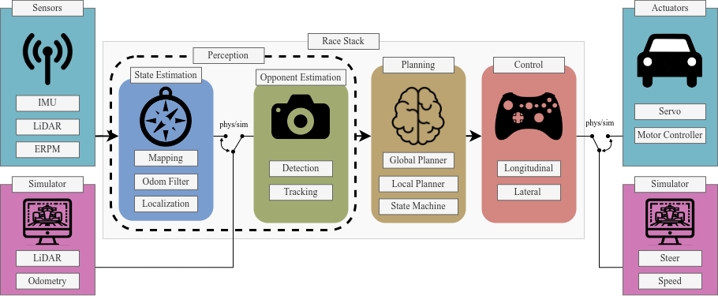

# base_system

In the base system you can use either the sim or the physical system. Both base systems have the same interfacing (i.e. topics) as can be further understood in [here](./f1tenth_system/README.md).

