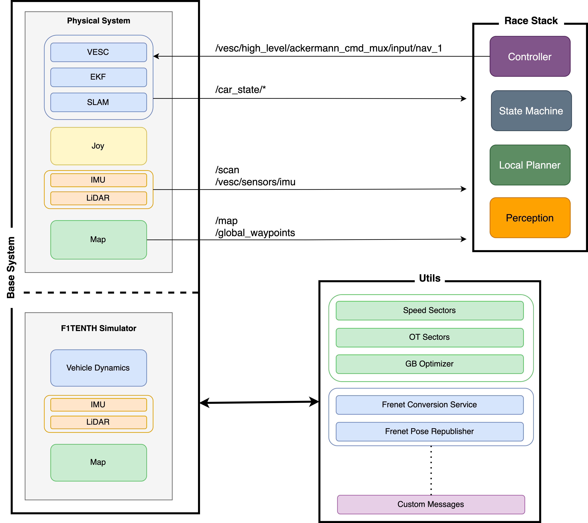

# Overall System Architecture


**Base System:** Either the [Simulator](../f110-simulator/README.md) or the [physical system](./README.md). They are both made to work interchangeably with each other i.e. offer the same outputs/inputs to the outside, as well as the same functionality. The base system launches many different nodes that originate inside the utils repo as well.
- [State Estimation](../../state_estimation/README.md)
- [Localisation](./racecar/racecar/launch/loc_map_launch.launch)
- [Mapping](./racecar/racecar/launch/mapping.launch)
- Sensor drivers
- Odometry
- Motor Control via [VESC](../../sensors/vesc/README.md)
- [Car State](./racecar/racecar/scripts/carstate_node.py)

**Utils:** Glues Simulator, physical system, racestack and the pit together. If there is cross repo functionality required, it belongs into utils s.t. interchangeability between the base systems is guaranteed.
- [Frenet Conversion Service](../../f110_utils/nodes/frenet_conversion_server/README.md)
- [Frenet State Republisher](../../f110_utils/nodes/frenet_odom_republisher/README.md)
- [Overtaking Sectors](../../f110_utils/nodes/overtaking_sector_tuner/README.md)
- [Speed Sectors](../../f110_utils/nodes/sector_tuner/README.md)
- [Tuner Packages](../../f110_utils/nodes/bayesopt4ros/README.md)
- [Custom Messages](../../f110_utils/libs/f110_msgs/README.md)
- etc

**Race Stack:** Here is the high level autonomy stack i.e. _Perception, Planning_ and _Control_ for simplicity we use a state machine as well.
- [Perception](../../perception/README.md)
- [Planning](../../planner/README.md) 
- [Control](../../controller/README.md)
- [State Machine](../../state_machine/README.md)

For quick usage refer to the passages below:

# Tele-Operation

To simply run the car in tele-op mode, i.e. remote controlled driving, you can use the following command, where `NAME_OF_RACECAR` is the name of the racecar you are using in the `stack_master/config` (e.g. `JET1`):

```bash
roslaunch racecar pbl_teleop.launch racecar_version:=NAME_OF_RACECAR
```

Hint: Make sure your controller is turned on! This is only meant to be used on the physical system


## [Mapping](./racecar/racecar/launch/mapping.launch)
`MAP_NAME` is the name you want to give to the map that you are now mapping. It will save the map in the `stack_master/maps` folder [here](../../../../stack_master/maps/). The default map that exists for the simulator is called `f`. You can use maps which were mapped in reality seamlessly in the simulator as well, but not vice-versa, as the physical system needs the `.pbstream` for the SLAM algorithm to localise.

### Physical System
```bash
roslaunch stack_master mapping.launch racecar_version:=NAME_OF_CAR map_name:=MAP_NAME
```
### Simulator
```bash
roslaunch stack_master mapping.launch map_name:=MAP_NAME racecar_version:=SIM sim:=True
```

**Note**:
You **NEED** to map first also in simulation.

## Base System
In the base system you can choose which localisation algorithm you want to use, either `slam Cartographer` or `synpf SynPF`.  
### Physical System
```bash
roslaunch stack_master base_system.launch map_name:=MAP_NAME racecar_version:=NAME_OF_CAR algo:=<slam or synpf>
```
### Simulator
```bash
roslaunch stack_master base_system.launch map_name:=MAP_NAME sim:=True racecar_version:=<SIM or NAME_OF_CAR> tire_model:=<linear/pacejka>
```
The simulator will use the parameters identified with the system identification procedures. You can find the source parameters [here](../../stack_master/config/README.md)


## [Time Trials](../../stack_master/launch/time_trials.launch)
You can choose the control algorithm to be used, either `MAP` or `PP` (Pure Pursuit). If you use PP, you do not need to specify the LUT.
### Physical System
```bash
roslaunch stack_master time_trials.launch LU_table:=NAME_OF_CAR_hangar_pacejka ctrl_algo:=<MAP or PP>
```
### Simulator
```bash
roslaunch stack_master time_trials.launch LU_table:=SIM_linear ctrl_algo:=<MAP or PP>
```

## [Head to Head](../../stack_master/launch/headtohead.launch)
You can choose the control algorithm to be used, either `MAP` or `PP` (Pure Pursuit). If you use PP, you do not need to specify the LUT.
The overtaking mode can be set to `spliner` as of know and future overtaking algorithms will be added.

### Physical System
```bash
roslaunch stack_master headtohead.launch LU_table:=NAME_OF_CAR_hangar_pacejka ctrl_algo:=<MAP or PP> overtake_mode:=spliner
```

### Simulator
```bash
roslaunch stack_master headtohead.launch LU_table:=SIM_linear ctrl_algo:=<MAP or PP> overtake_mode:=spliner
```

To test head-to-head in sim, run the following to publish a dummy opponent:
```bash
roslaunch obstacle_publisher obstacle_publisher.launch speed:=1
```


