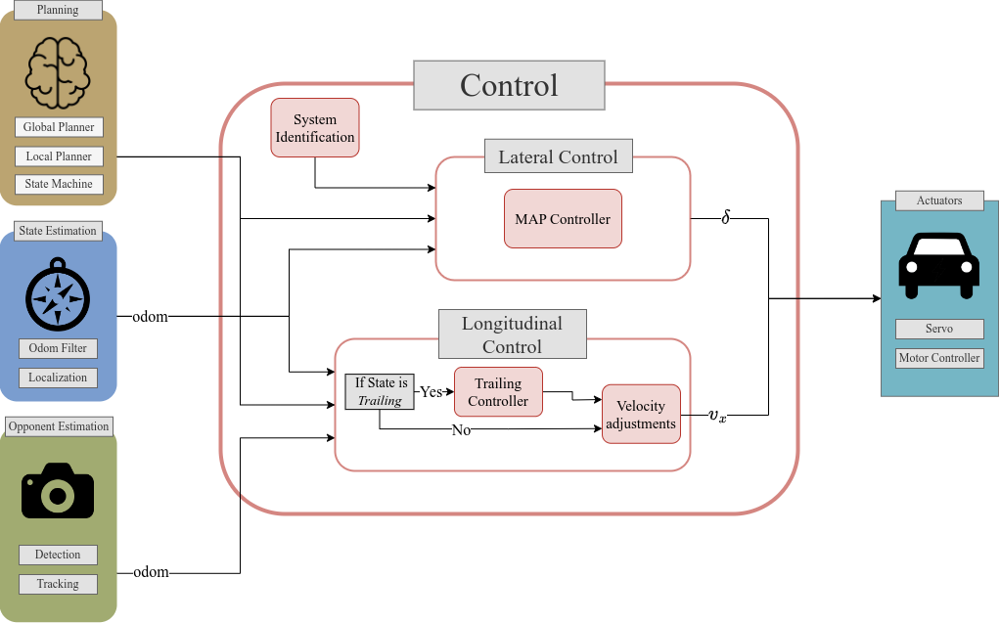
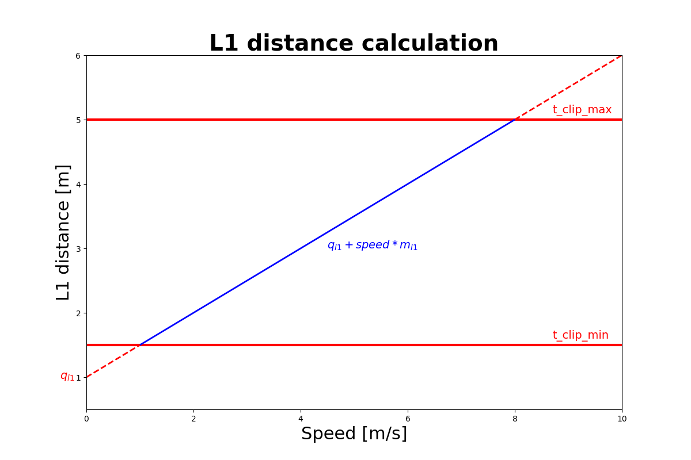

# Controller Manager


This controller package implements the following controllers:
- [MAP controller](#model--and-acceleration-based-pursuit-map-controller)
- [Pure Pursuit controller](#pure-pursuit-pp-controller)
- [Follow the Gap controller](#follow-the-gap-ftg-controller)

The `controller_manager` implemented in `controller_manager.py` initializes the needed controllers. It runs at a specified loop rate where in each cycle the next control inputs are calculated via the choosen controller.

## Input/Output Topic Signature
This nodes subscribes to:
- `/perception/obstacles`: Subscribes to the obstacle array.
- `/car_state/odom`: Reads the car's state
- `/car_state/pose`: Reads the car's state
- `/car_state/frenet/odom`: Reads the car's state
- `/global_waypoints`: Subscribes to local waypoints.
- `/vesc/sensors/imu/raw`: Reads the IMU measurements.
- `/scan`: Reads the LiDAR scans.
- `/l1_param_cb`: Listens to the L1 parameters.


The node publishes to:
- `/drive`: Publishes the control commands.
- `/lookahead_point`: Publishes lookahead point marker.
- `/steering`: Publishes steering arrow marker.
- `/trailing_opponent_marker`: Published trailing opponend marker.
- `/my_waypoints`: Publishes marker array of the received waypoints.
- `/l1_distance`: Publishes the L1 distance.
- `/trailing/gap_data`: Publishes the PID data for trailing.

# Model- and Acceleration-based Pursuit (MAP) controller
The MAP Controller based on [Model- and Acceleration-based Pursuit Controller for High-Performance Autonomous Racing](https://arxiv.org/pdf/2209.04346.pdf) calculates and publishes the optimal steering angle based on a vehicle model and velocity to track a given trajectory. It is managed by the `controller_manager.py` node.

## Longitudinal controller
The speed from the global optimizer is propagated to compensate for the delay and scaled according to the lateral error and the curvature of the waypoints. 


`<parameter_name>`: description [minimum, maximum, tuned]

- `speed_lookahead`: Lookahead time in seconds to account for actuation and computation delay [0, ∞, 0.25]
- `lat_err_coeff`: How much of the lateral error is taken into account to smoothly rejoin the trajectory. Higher values increase the dependence of the lateral error on the speed reduction. [0, 1, 1]


### Trailing Controller

- `trailing_gap`: reference gap to the to-be-trailed opponent in meters[0, ∞, 1.5] 
- `trailing_p_gain`: P-Gain of trailing controller [0, ∞, 1]
- `trailing_i_gain`: I-Gain of trailing controller [0, ∞, 0]
- `trailing_d_gain`: D-Gain of trailing controller [0, ∞, 0.2]
- `blind_trailing_speed`: Minimal Trailing speed when opponent not in line-of-sight [0, ∞, 1.5]
- `prioritize_dyn`: Ignore static obstacles, when a dynamic obstacle is present [False, True, True]


## Lateral controller
It uses the L1 guidance described in this paper: [Model- and Acceleration-based Pursuit Controller for High-Performance Autonomous Racing](https://arxiv.org/abs/2209.04346). 

The idea is to compute the lateral acceleration and covert this with a lookup table into steering angles.
To prevent oscillations when driving fast and to be able to track small curvatures, the L1 is scaled with delay compensated speed. For the lookup, the speed is propagated to compensate for the steering delay.
When accelerating faster then 1 m/s^2, the steering is reduced and for deacceleration higher than -1m/s^2 the steering is increased.


- `m_l1`: Proportional term for the affine mapping of the velocity to the lookahead distance
for the MAP controller [0, ∞, 0.6] 
- `q_l1`: Offset term for the affine mapping of the velocity to the lookahead distance. [−∞, ∞, -0.18]
- `t_clip_min`: clipping value for minimal L1 distance [0, ∞, 0.8]
- `t_clip_max`: clipping value for maximal L1 distance [0, ∞, 5]



At high speeds the steering is downscaled by a factor to reduce tire slipping 
- `start_scale_speed`: start of downscaling speed range [0, ∞, 7]
- `end_scale_speed`: end of downscaling speed range [0, ∞, 8]
- `downscale_factor`: percent of steer downscaling [0, 100, 20]


- `acc_scaler_for_steer`: when accelerating stronger than 1m/s^2 the steering is increased by this factor [1, ∞, 1.2]
- `dec_scaler_for_steer`: when accelerating stronger than -1m/s^2 the steering is reduced by this factor [0, 1, 0.9]
- `speed_lookahead_for_steer`: Lookahead time in seconds propagate velocity, for steering lookup. Can increase laptime by cutting more corners [0, 0.2, 0]


## Basic Use

The controller can be started by using the following command:
```
ros2 launch controller controller_launch.xml mode:=MAP
```

However we suggest to use the launch files present in the `stack_master package`.

# Pure Pursuit (PP) controller
The goal of the Control module within the ForzaETH Race Stack is to enable performant, safe, and consistent lap completions by accurately tracking a trajectory provided by the local planner.
The velocity and steering commands are managed, respectively, by the longitudinal and lateral controllers.

## Longitudinal controller
The longitudinal controller computes the desired velocity of the racecar. This velocity is either obtained directly from the velocity of the local trajectory or computed by the trailing controller if the car is trailing an opponent and therefore in the Trailing state.

The speed from the local trajectory is propagated to compensate for the delay and scaled according to the lateral error and the curvature of the waypoints.


### Parameters
- `<parameter_name>`: description [minimum, maximum, tuned]

- `speed_lookahead`: Lookahead time in seconds to account for actuation and computation delay [0, ∞, 0.25]

- `lat_err_coeff`: How much of the lateral error is taken into account to smoothly rejoin the trajectory. Higher values increase the dependence of the lateral error on the speed reduction. [0, 1, 1]


### Trailing Controller Parameters


- `trailing_gap`: reference gap to the to-be-trailed opponent in meters[0, ∞, 1.5] 

- `trailing_p_gain`: P-Gain of trailing controller [0, ∞, 1]

- `trailing_i_gain`: I-Gain of trailing controller [0, ∞, 0]

- `trailing_d_gain`: D-Gain of trailing controller [0, ∞, 0.2]

- `blind_trailing_speed`: Minimal Trailing speed when opponent not in line-of-sight [0, ∞, 1.5]

- `prioritize_dyn`: Ignore static obstacles, when a dynamic obstacle is present [False, True, True]


## Lateral controller
The Pure Pursuit controller computes the steering angle via geometric considerations.
To prevent oscillations when driving fast and to be able to track small curvatures, the L1 is scaled with delay compensated speed. For the steering angle caculations, the speed is propagated to compensate for the steering delay.
When accelerating faster then 1 m/s^2, the steering is reduced and for deacceleration higher than -1m/s^2 the steering is increased.

### Parameters

- `m_l1`: Proportional term for the affine mapping of the velocity to the lookahead distance
for the PP controller [0, ∞, 0.6] 

- `q_l1`: Offset term for the affine mapping of the velocity to the lookahead distance. [−∞, ∞, -0.18]

- `t_clip_min`: clipping value for minimal L1 distance [0, ∞, 0.8]

- `t_clip_max`: clipping value for maximal L1 distance [0, ∞, 5]


At high speeds the steering is downscaled by a factor to reduce tire slipping 

- `start_scale_speed`: start of downscaling speed range [0, ∞, 7]

- `end_scale_speed`: end of downscaling speed range [0, ∞, 8]

- `downscale_factor`: percent of steer downscaling [0, 100, 20]


- `acc_scaler_for_steer`: when accelerating stronger than 1m/s^2 the steering is increased by this factor [1, ∞, 1.2]

- `dec_scaler_for_steer`: when accelerating stronger than -1m/s^2 the steering is reduced by this factor [0, 1, 0.9]

- `speed_lookahead_for_steer`: Lookahead time in seconds propagate velocity, for steering lookup. Can increase laptime by cutting more corners [0, 0.2, 0]


## Basic Use

The controller can be started by using the following command:
```
ros2 launch controller controller_launch.xml mode:=PP
```

However we suggest to use the launch files present in the `stack_master package`.


# Follow The Gap (FTG) controller

## Description
The Follow-The-Gap (FTG) Controller is a simple reactive controller which uses directly the LiDAR scans and the car's pose to compute and publish the velocity and steering angle of the car. In our race stack, the FTG controller is mainly used for mapping, so that we do not have to drive manually around the track. However, even though never used in practice anymore, there is the possibility to set a sector in the state machine as `FTGONLY` and then the FTG controller managed by `controller_manager.py` is used during these sectors.

 ## Parameters
 - `track_width`: Approximate width of the track.
 - `max_speed`: Maximum speed allowed.
 - `safety_radius`: Safety radius to reduce cutting corners.
 - `max_lidar_dist`: Maximum possible scan distance of the LiDAR.
 - `range_offset`: Range of LiDAR points to be considered, only consider `[range_offset,-range_offset]`.
 - `debug`: If set to `True`, the best gap, best point and preprocessed LiDAR scans are published as Markers.
