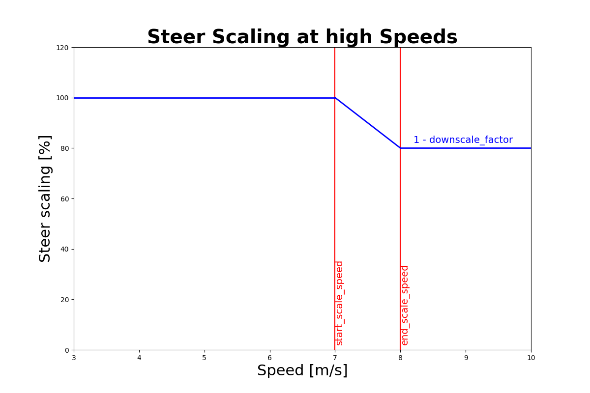

# Model- and Acceleration-based Pursuit (MAP) controller
The MAP Controller based on [Model- and Acceleration-based Pursuit Controller for High-Performance Autonomous Racing](https://arxiv.org/pdf/2209.04346.pdf) calculates and publishes the optimal steering angle based on a vehicle model and velocity to track a given trajectory. It is managed by the `controller_manager.py` node.

## Longitudinal controller
The speed from the global optimizer is propagated to compensate for the delay and scaled according to the lateral error and the curvature of the waypoints. 


`<parameter_name>`: description [minimum, maximum, tuned]

- `speed_lookahead`: Lookahead time in seconds to account for actuation and computation delay [0, ∞, 0.25]
- `lat_err_coeff`: How much of the lateral error is taken into account to smoothly rejoin the trajectory. Higher values increase the dependence of the lateral error on the speed reduction. [0, 1, 1]


### Trailing Controller

- `trailing_gap`: reference gap to the to-be-trailed opponent in meters[0, ∞, 1.5] 
- `trailing_p_gain`: P-Gain of trailing controller [0, ∞, 1]
- `trailing_i_gain`: I-Gain of trailing controller [0, ∞, 0]
- `trailing_d_gain`: D-Gain of trailing controller [0, ∞, 0.2]
- `blind_trailing_speed`: Minimal Trailing speed when opponent not in line-of-sight [0, ∞, 1.5]
- `prioritize_dyn`: Ignore static obstacles, when a dynamic obstacle is present [False, True, True]


## Lateral controller
It uses the L1 guidance described in this paper: [Model- and Acceleration-based Pursuit Controller for High-Performance Autonomous Racing](https://arxiv.org/abs/2209.04346). 

The idea is to compute the lateral acceleration and covert this with a lookup table into steering angles.
To prevent oscillations when driving fast and to be able to track small curvatures, the L1 is scaled with delay compensated speed. For the lookup, the speed is propagated to compensate for the steering delay.
When accelerating faster then 1 m/s^2, the steering is reduced and for deacceleration higher than -1m/s^2 the steering is increased.


- `m_l1`: Proportional term for the affine mapping of the velocity to the lookahead distance
for the MAP controller [0, ∞, 0.6] 
- `q_l1`: Offset term for the affine mapping of the velocity to the lookahead distance. [−∞, ∞, -0.18]
- `t_clip_min`: clipping value for minimal L1 distance [0, ∞, 0.8]
- `t_clip_max`: clipping value for maximal L1 distance [0, ∞, 5]


At high speeds the steering is downscaled by a factor to reduce tire slipping 
- `start_scale_speed`: start of downscaling speed range [0, ∞, 7]
- `end_scale_speed`: end of downscaling speed range [0, ∞, 8]
- `downscale_factor`: percent of steer downscaling [0, 100, 20]


- `acc_scaler_for_steer`: when accelerating stronger than 1m/s^2 the steering is increased by this factor [1, ∞, 1.2]
- `dec_scaler_for_steer`: when accelerating stronger than -1m/s^2 the steering is reduced by this factor [0, 1, 0.9]
- `speed_lookahead_for_steer`: Lookahead time in seconds propagate velocity, for steering lookup. Can increase laptime by cutting more corners [0, 0.2, 0]


## Basic Use

The controller can be started by using the following command:
```
rosrun controller L1_controller.py
```

However we suggest to use the launch files present in the `stack_master package`.
