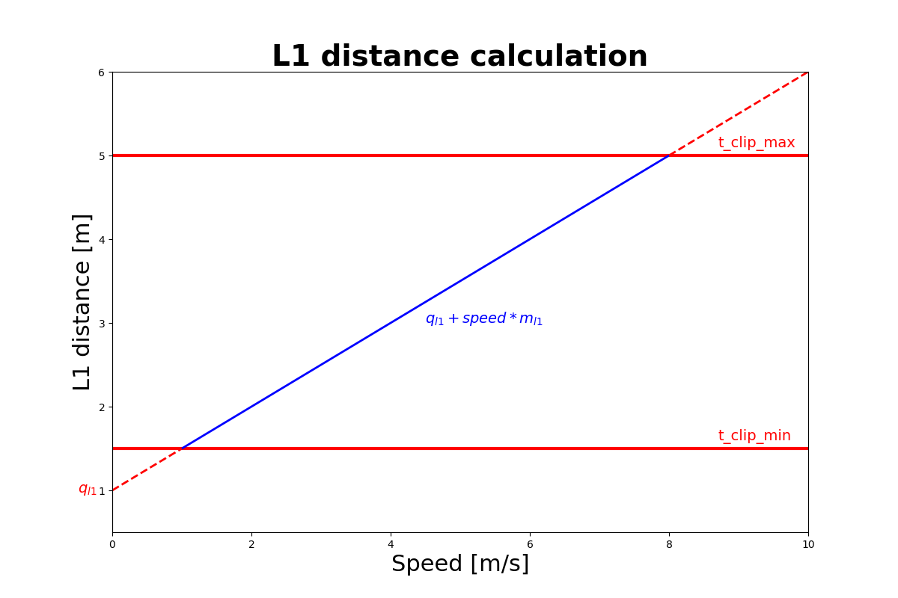
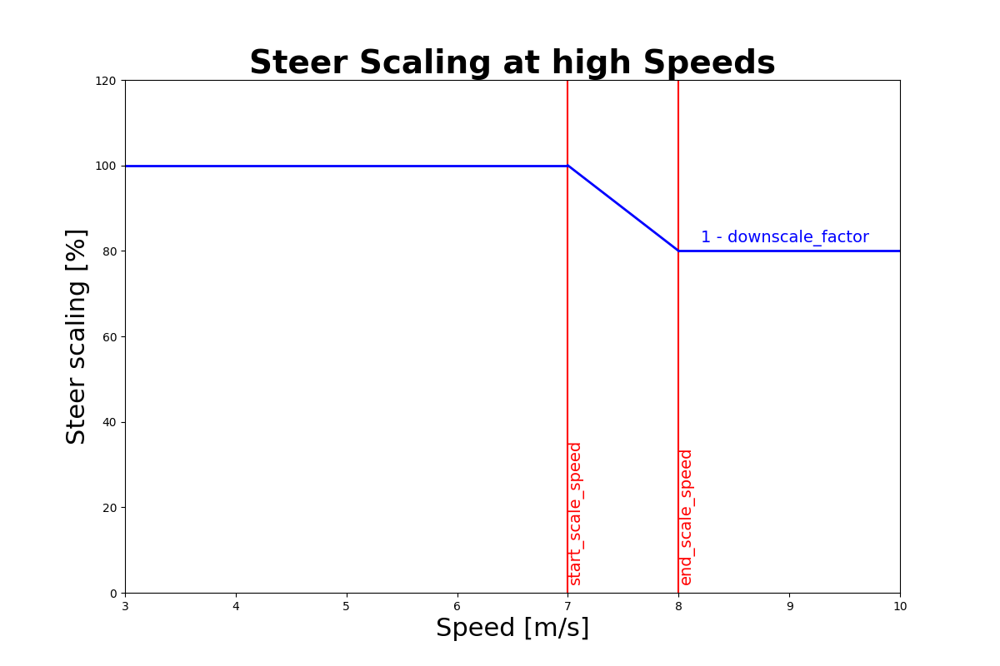

# Pure Pursuit (PP) controller
The goal of the Control module within the ForzaETH Race Stack is to enable performant, safe, and consistent lap completions by accurately tracking a trajectory provided by the local planner.
The velocity and steering commands are managed, respectively, by the longitudinal and lateral controllers.

## Longitudinal controller
The longitudinal controller computes the desired velocity of the racecar. This velocity is either obtained directly from the velocity of the local trajectory or computed by the trailing controller if the car is trailing an opponent and therefore in the Trailing state.

The speed from the local trajectory is propagated to compensate for the delay and scaled according to the lateral error and the curvature of the waypoints.


### Parameters
- `<parameter_name>`: description [minimum, maximum, tuned]

- `speed_lookahead`: Lookahead time in seconds to account for actuation and computation delay [0, ∞, 0.25]

- `lat_err_coeff`: How much of the lateral error is taken into account to smoothly rejoin the trajectory. Higher values increase the dependence of the lateral error on the speed reduction. [0, 1, 1]


### Trailing Controller Parameters


- `trailing_gap`: reference gap to the to-be-trailed opponent in meters[0, ∞, 1.5] 

- `trailing_p_gain`: P-Gain of trailing controller [0, ∞, 1]

- `trailing_i_gain`: I-Gain of trailing controller [0, ∞, 0]

- `trailing_d_gain`: D-Gain of trailing controller [0, ∞, 0.2]

- `blind_trailing_speed`: Minimal Trailing speed when opponent not in line-of-sight [0, ∞, 1.5]

- `prioritize_dyn`: Ignore static obstacles, when a dynamic obstacle is present [False, True, True]


## Lateral controller
The Pure Pursuit controller computes the steering angle via geometric considerations.
To prevent oscillations when driving fast and to be able to track small curvatures, the L1 is scaled with delay compensated speed. For the steering angle caculations, the speed is propagated to compensate for the steering delay.
When accelerating faster then 1 m/s^2, the steering is reduced and for deacceleration higher than -1m/s^2 the steering is increased.

### Parameters

- `m_l1`: Proportional term for the affine mapping of the velocity to the lookahead distance
for the PP controller [0, ∞, 0.6] 

- `q_l1`: Offset term for the affine mapping of the velocity to the lookahead distance. [−∞, ∞, -0.18]

- `t_clip_min`: clipping value for minimal L1 distance [0, ∞, 0.8]

- `t_clip_max`: clipping value for maximal L1 distance [0, ∞, 5]



At high speeds the steering is downscaled by a factor to reduce tire slipping 

- `start_scale_speed`: start of downscaling speed range [0, ∞, 7]

- `end_scale_speed`: end of downscaling speed range [0, ∞, 8]

- `downscale_factor`: percent of steer downscaling [0, 100, 20]



- `acc_scaler_for_steer`: when accelerating stronger than 1m/s^2 the steering is increased by this factor [1, ∞, 1.2]

- `dec_scaler_for_steer`: when accelerating stronger than -1m/s^2 the steering is reduced by this factor [0, 1, 0.9]

- `speed_lookahead_for_steer`: Lookahead time in seconds propagate velocity, for steering lookup. Can increase laptime by cutting more corners [0, 0.2, 0]


## Basic Use

The controller can be started by using the following command:
```
roslaunch stack_master time_trials.launch ctrl_algo:=PP
```
