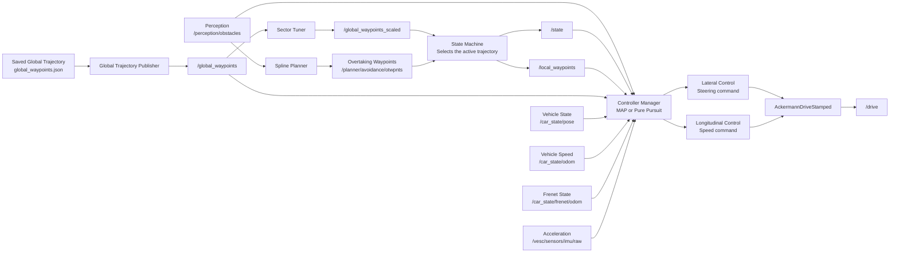
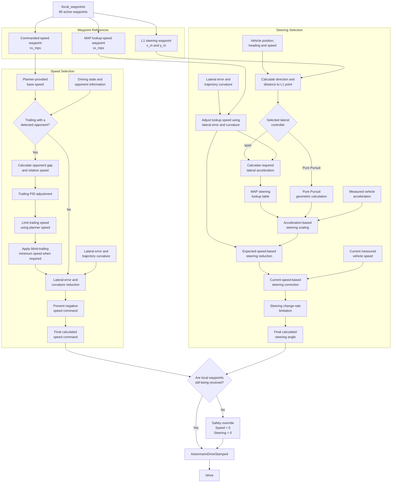
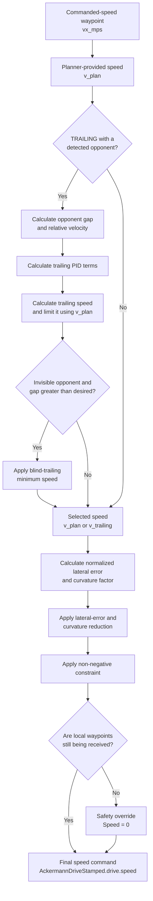
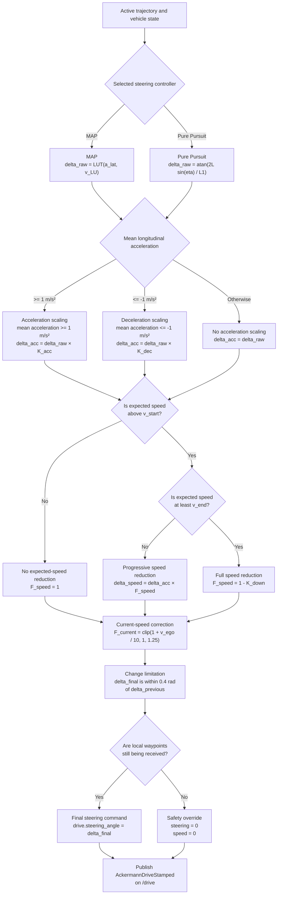
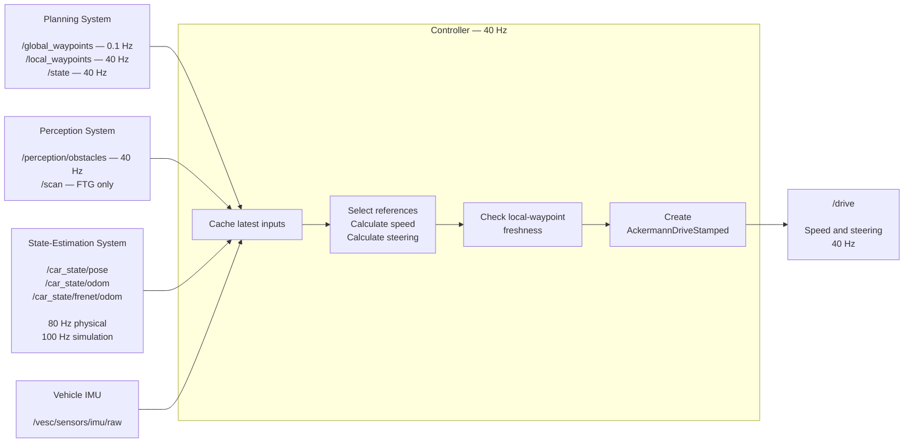

# F1TENTH Controller

## Documentation Overview

This document explains how the F1TENTH controller receives a trajectory and converts it into speed and steering commands.

Use the following links to navigate directly to the relevant topic:

| Topic | Description |
|---|---|
| [Controller Responsibilities](#controller-responsibilities) | Introduces trajectory following, trailing, and overtaking. |
| [Controller Data Flow](#controller-data-flow) | Shows the complete path from the global planner to `/drive`. |
| [Waypoint Selection](#waypoint-selection) | Explains the 80 local waypoints and the three references selected by the controller. |
| [Speed Selection](#speed-selection) | Explains planner-based speed selection, trailing control, and speed adjustments. |
| [Steering Selection](#steering-selection) | Explains MAP, Pure Pursuit, the steering lookup table, and steering adjustments. |
| [Controller Tuning](#controller-tuning) | Lists the parameters used to tune waypoint, speed, and steering behavior. |
| [Controller Interface Contract](#controller-interface-contract) | Defines the messages, fields, frequencies, and assumptions required by the controller. |
| [Output Contract](#output-contract) | Describes the final `AckermannDriveStamped` message published on `/drive`. |


## Controller Responsibilities

The controller handles three primary driving scenarios:

1. **Trajectory following**
2. **Trailing**
3. **Overtaking**

Although all three scenarios involve following a trajectory, each occurs in a different racing context and requires distinct control behavior.

During a time trial, the controller is responsible only for following the trajectory provided by the planner. In head-to-head racing, it must also handle trailing and overtaking.

### Trajectory Following

During normal trajectory following, the controller tracks the trajectory provided by the planner. It regulates the vehicle's steering and speed to minimize tracking error while maintaining stability.

### Trailing

Trailing occurs when the ego vehicle approaches an opponent but cannot yet overtake safely. The controller follows the opponent while maintaining a safe distance and avoiding a collision.

Unlike normal trajectory following, the vehicle may not be able to follow the planned trajectory at the desired speed. The controller must therefore adjust its speed based on the opponent's position and velocity while remaining ready to begin an overtaking maneuver.

### Overtaking

Overtaking occurs when the ego vehicle attempts to pass an opponent. The planner provides an alternative trajectory that guides the vehicle around the opponent and back toward the desired racing line.

The controller must accurately follow this trajectory while accounting for the limited available space and the opponent's motion. It regulates the vehicle's steering and speed to complete the maneuver while maintaining stability and avoiding a collision.


## Controller Data Flow




The main data path begins with the global trajectory generated by the planner. The trajectory is adjusted by the sector tuner, selected and localized by the state machine, and then provided to the controller through `/local_waypoints`.

```text
global_waypoints.json
→ Global Trajectory Publisher
→ /global_waypoints
→ Sector Tuner
→ /global_waypoints_scaled
→ State Machine
→ /local_waypoints
→ Controller
→ AckermannDriveStamped
→ /drive
```

### 1. Global Trajectory

The global planner generates the reference racing line and saves it in `global_waypoints.json`. During a race, the trajectory is loaded and published by the [global trajectory publisher](planner/global_planner/global_planner/global_trajectory_publisher.py).

The complete trajectory is published as an `f110_msgs/WpntArray` message on:

```text
/global_waypoints
```

Each waypoint contains the following information:

| Field | Description |
|---|---|
| `id` | Waypoint index |
| `s_m` | Distance along the track |
| `d_m` | Lateral position in Frenet coordinates |
| `x_m`, `y_m` | Position in map coordinates |
| `d_left`, `d_right` | Distance to the track boundaries |
| `psi_rad` | Heading of the trajectory |
| `kappa_radpm` | Trajectory curvature |
| `vx_mps` | Desired velocity |
| `ax_mps2` | Desired acceleration |

The message definitions are available in [Wpnt.msg](utilities/libraries/f110_msgs/msg/Wpnt.msg) and [WpntArray.msg](utilities/libraries/f110_msgs/msg/WpntArray.msg).

A simplified waypoint array looks like this:

```yaml
header:
  frame_id: map

wpnts:
  - id: 0
    s_m: 0.0
    d_m: 0.0
    x_m: 1.42
    y_m: 3.18
    psi_rad: 0.52
    kappa_radpm: 0.08
    vx_mps: 6.0
    ax_mps2: 0.2

  - id: 1
    s_m: 0.1
    d_m: 0.0
    x_m: 1.51
    y_m: 3.23
    psi_rad: 0.54
    kappa_radpm: 0.09
    vx_mps: 5.9
    ax_mps2: 0.1
```

### 2. Sector Tuner

The [sector tuner](utilities/nodes/sector_tuner/sector_tuner/sector_tuner.py) subscribes to `/global_waypoints` and applies a configurable velocity scaling factor to each track sector.

The waypoint geometry remains unchanged, while the desired velocity field, `vx_mps`, is adjusted:

```text
scaled velocity = planner velocity × sector scaling factor
```

The modified trajectory is published on:

```text
/global_waypoints_scaled
```

### 3. State Machine

The state machine selects which trajectory the vehicle should follow based on the current driving state:

- `GB_TRACK` selects the scaled global trajectory.
- `TRAILING` normally follows the global trajectory while the controller adjusts the speed relative to the opponent.
- `OVERTAKE` uses the trajectory produced by the spline planner.
- `FTGONLY` does not provide local waypoints.

The main state-machine node is implemented in [state_machine.py](state_machine/state_machine/state_machine.py), while the waypoint-selection behavior for each state is defined in [states.py](state_machine/state_machine/states.py).

Instead of publishing the complete track, the state machine selects a window of waypoints ahead of the vehicle and publishes it as an `f110_msgs/WpntArray` on:

```text
/local_waypoints
```

This local array is the trajectory that the controller actually follows.

### 4. Controller

The [controller manager](controller/controller/controller_manager.py) subscribes to `/local_waypoints` and converts every received waypoint into an internal array containing:

```text
[x, y, desired velocity, track-bound ratio, s, curvature, heading, acceleration]
```

The controller also receives the current vehicle pose, velocity, Frenet state, acceleration, current driving state, and detected opponents.

Depending on the selected control algorithm, steering is calculated by either:

- [MAP controller](controller/controller/map.py)
- [Pure Pursuit controller](controller/controller/pp.py)

The longitudinal controller obtains its target speed from the local trajectory. During trailing, this speed may be reduced to maintain the desired distance from the opponent.

### 5. Command Generation

At each control cycle, the controller combines the calculated speed and steering angle into an `ackermann_msgs/AckermannDriveStamped` message:

```python
ack_msg = AckermannDriveStamped()
ack_msg.drive.steering_angle = float(steer)
ack_msg.drive.speed = float(speed)
```

The completed command is then published on:

```text
/drive
```

The simulator or physical vehicle interface subscribes to `/drive` and converts the requested speed and steering angle into vehicle motion.

## Waypoint Selection

Before the controller selects its reference waypoints, the global trajectory passes through the sector tuner and the state machine:

```text
/global_waypoints
→ Sector Tuner
→ /global_waypoints_scaled
→ State Machine
→ /local_waypoints
→ Controller
```

The sector tuner adjusts the velocity profile of the global trajectory according to the configured track sectors. The state machine then selects the active trajectory based on the current driving state:

- During normal trajectory following, it selects the scaled global trajectory.
- During trailing, it selects either the global trajectory or the last valid avoidance trajectory.
- During overtaking, it combines the global trajectory with the trajectory generated by the spline planner.

### The Local Waypoint Window

The state machine does not send the entire track to the controller. Instead, it uses the vehicle's Frenet position, `cur_s`, to locate its approximate position along the global trajectory:

```text
starting waypoint index = round(cur_s / waypoint_spacing)
```

The implementation assumes a waypoint spacing of:

```text
waypoint_spacing = 0.1 m
```

Starting from the calculated index, the state machine selects the next 80 waypoints and publishes them on `/local_waypoints`.

Therefore, the local trajectory covers approximately:

```text
80 waypoints × 0.1 m/waypoint = 8 m
```

The state machine publishes this moving window at `40 Hz`, allowing the local trajectory to advance with the vehicle.

The 80-waypoint window provides the controller with enough trajectory to select its reference points without processing the entire track. In particular, it is longer than the maximum configured L1 steering lookahead of `5 m`, leaving additional waypoints for the other selections and for situations in which the waypoint nearest to the vehicle is not the first waypoint in the local array.

For example, if the vehicle is near global waypoint `1200`, the state machine selects approximately:

```text
Global waypoint indices:
1200, 1201, 1202, ..., 1279
```

Inside `/local_waypoints`, these become:

```text
Local waypoint indices:
0, 1, 2, ..., 79
```

When the vehicle approaches the end of the global trajectory, the selection wraps around to the beginning:

```text
..., 2497, 2498, 2499, 0, 1, 2, ...
```

The same 80-waypoint format is used during overtaking, but the relevant part of the global trajectory is replaced by the spline-planner trajectory.

### Controller Representation

When the controller receives `/local_waypoints`, it converts each waypoint into the following internal representation:

```text
[x, y, velocity, track-bound ratio, s, curvature, heading, acceleration]
```

The controller then selects three references from this array:

1. the waypoint that supplies the commanded speed;
2. the waypoint that supplies the speed used by the MAP steering lookup table;
3. the waypoint used as the L1 steering target.

These references serve different purposes and do not necessarily select the same waypoint.

### Selection Methods

| Reference | Position projected using heading? | Euclidean nearest-point search? | Index offset afterward? |
|---|---:|---:|---:|
| Commanded speed | Yes | Yes | No |
| MAP lookup speed | Yes | Yes | No |
| Steering target | No | Yes, for the starting index | Yes |

### Variables

| Variable | Unit | Description |
|---|---:|---|
| `current_x`, `current_y` | m | Current vehicle position in the map frame |
| `yaw` | rad | Current vehicle heading in the map frame |
| `speed_now` | m/s | Current measured longitudinal speed |
| `v_x`, `v_y` | m/s | Map-frame components of the vehicle's velocity |
| `speed_lookahead` | s | Time projection used to select the commanded-speed waypoint |
| `speed_lookahead_for_steer` | s | Time projection used to select the speed supplied to the MAP lookup table |
| `vx_mps` | m/s | Desired velocity stored in a waypoint |
| `q_l1` | m | Constant term in the L1 lookahead calculation |
| `m_l1` | s | Speed-dependent coefficient in the L1 lookahead calculation |
| `t_clip_min` | m | Minimum permitted L1 lookahead distance |
| `t_clip_max` | m | Maximum permitted L1 lookahead distance |
| `lateral_error` | m | Vehicle's lateral displacement from the global racing line |
| `L1_distance` | m | Distance used to select the steering target |
| `L1_point` | m | Selected steering target in map coordinates |

The following examples use representative physical-car parameters:

```yaml
t_clip_min: 0.9
t_clip_max: 5.0
m_l1: 0.55
q_l1: -0.03
speed_lookahead: 0.25
speed_lookahead_for_steer: 0.0
```

The exact values depend on the selected vehicle configuration.

### 1. Commanded-Speed Waypoint

The commanded-speed waypoint supplies the planned velocity, `vx_mps`, used as the base speed command.

The controller begins by expressing the vehicle's measured speed in the map frame using its current heading:

```text
v_x = speed_now × cos(yaw)
v_y = speed_now × sin(yaw)
```

It then projects the vehicle's position forward:

```text
projected_x = current_x + v_x × speed_lookahead
projected_y = current_y + v_y × speed_lookahead
```

Because `speed_lookahead` is expressed in seconds, this projection estimates where the vehicle will be after the configured amount of time. It helps compensate for the delay between selecting a speed and the vehicle responding to that command.

The controller calculates the Euclidean distance from the projected position to every waypoint in `/local_waypoints`:

```text
distance_i = √(
    (waypoint_x_i - projected_x)²
    + (waypoint_y_i - projected_y)²
)
```

The waypoint with the smallest distance is selected:

```text
selected index = arg min(distance_i)
```

Its `vx_mps` value becomes the base speed command.

#### Example

Suppose:

```text
Vehicle position = (10.0, 5.0) m
Vehicle heading = 0 rad
Current speed = 6.0 m/s
speed_lookahead = 0.25 s
```

The map-frame velocity vector is:

```text
v_x = 6.0 × cos(0) = 6.0 m/s
v_y = 6.0 × sin(0) = 0.0 m/s
```

The projected position is:

```text
projected_x = 10.0 + 6.0 × 0.25 = 11.5 m
projected_y = 5.0 + 0.0 × 0.25 = 5.0 m
```

The controller searches the local trajectory for the waypoint closest to `(11.5, 5.0)`.

If that waypoint contains:

```yaml
vx_mps: 7.2
```

the base speed command is:

```text
7.2 m/s
```

During normal trajectory following and overtaking, the controller mainly trusts this planner-generated velocity. It can reduce the value when the lateral tracking error is large or the upcoming trajectory has high curvature. During trailing, it can reduce the speed further to maintain the desired gap from the opponent.

### 2. MAP Lookup-Speed Waypoint

The MAP controller selects a second waypoint to obtain the expected speed used by its steering lookup table.

This reference is separate from the commanded-speed waypoint because the speed used to calculate steering may need a different lookahead. Its selection uses the same forward-projection and Euclidean-distance procedure, but with `speed_lookahead_for_steer`:

```text
lookup_projected_x =
current_x + v_x × speed_lookahead_for_steer

lookup_projected_y =
current_y + v_y × speed_lookahead_for_steer
```

The controller then selects the local waypoint closest to this projected position and reads its `vx_mps` value.

This value is used as a lookup-table input; it is not published as the vehicle's speed command.

#### Example with No Lookahead

Suppose:

```text
Vehicle position = (10.0, 5.0) m
Vehicle heading = 0 rad
Current speed = 6.0 m/s
speed_lookahead_for_steer = 0.0 s
```

The projected position remains unchanged:

```text
lookup_projected_x = 10.0 + 6.0 × 0.0 = 10.0 m
lookup_projected_y = 5.0 + 0.0 × 0.0 = 5.0 m
```

The controller therefore uses the planned speed from the local waypoint closest to the vehicle's current position.

If that waypoint contains:

```yaml
vx_mps: 6.4
```

then `6.4 m/s` is supplied to the MAP lookup table. This can differ from the `7.2 m/s` selected as the commanded speed farther ahead.

#### Example with Lookahead

Suppose the parameter is instead:

```text
speed_lookahead_for_steer = 0.175 s
```

At `6.0 m/s`, the projected distance is approximately:

```text
6.0 m/s × 0.175 s = 1.05 m
```

For a vehicle travelling along the positive x-axis, the projected position becomes:

```text
lookup_projected_x = 10.0 + 1.05 = 11.05 m
lookup_projected_y = 5.0 m
```

The controller selects the waypoint closest to `(11.05, 5.0)` and uses its `vx_mps` value for the MAP lookup.

A larger lookup-speed lookahead allows MAP to use the expected speed farther along the trajectory. However, excessive lookahead can produce overly anticipatory steering and contribute to corner cutting.

During trailing, when opponent information is available, MAP uses the vehicle's current measured speed for the lookup instead of selecting a planned speed from the trajectory.

### 3. Steering Reference Waypoint

The steering reference is the L1 point. Its selection differs from the two speed references because the vehicle position is not projected using its heading.

First, the controller finds the local waypoint closest to the vehicle's current position using Euclidean distance:

```text
distance_i = √(
    (waypoint_x_i - current_x)²
    + (waypoint_y_i - current_y)²
)

nearest index = arg min(distance_i)
```

The controller then calculates the desired L1 distance:

```text
raw L1 distance = q_l1 + speed_now × m_l1
```

The minimum distance also depends on the lateral error:

```text
lower limit = max(t_clip_min, √2 × lateral_error)
```

The final value is constrained to the permitted range:

```text
L1_distance = clip(
    raw L1 distance,
    lower limit,
    t_clip_max
)
```

Because the controller assumes `0.1 m` spacing between waypoints, it converts the L1 distance into an index offset:

```text
index offset = round(L1_distance / 0.1)
```

The steering target is then selected by advancing this number of indices from the nearest waypoint:

```text
L1 waypoint index = nearest index + index offset
```

If the calculated index exceeds the end of `/local_waypoints`, the controller uses the final waypoint in the local array.

#### Example at Low Speed

Suppose:

```text
speed_now = 1.0 m/s
q_l1 = -0.03 m
m_l1 = 0.55 s
t_clip_min = 0.9 m
lateral_error = 0.1 m
```

The raw L1 distance is:

```text
raw L1 distance = -0.03 + 1.0 × 0.55
                = 0.52 m
```

The lateral-error limit is:

```text
√2 × 0.1 ≈ 0.14 m
```

Therefore:

```text
lower limit = max(0.9, 0.14) = 0.9 m
```

Since the raw distance is below this limit, the final distance is:

```text
L1_distance = 0.9 m
```

The corresponding index offset is:

```text
round(0.9 / 0.1) = 9 waypoints
```

If the nearest local waypoint has index `2`, the selected L1 waypoint is:

```text
2 + 9 = local waypoint 11
```

#### Example at Racing Speed

Suppose:

```text
speed_now = 6.0 m/s
lateral_error = 0.1 m
```

The raw distance is:

```text
raw L1 distance = -0.03 + 6.0 × 0.55
                = 3.27 m
```

This value is within the configured limits, so:

```text
L1_distance = 3.27 m
```

The index offset is approximately:

```text
round(3.27 / 0.1) = 33 waypoints
```

If the nearest local waypoint has index `2`, the steering target is approximately:

```text
2 + 33 = local waypoint 35
```

#### Example at High Speed

Suppose:

```text
speed_now = 10.0 m/s
```

The raw distance is:

```text
raw L1 distance = -0.03 + 10.0 × 0.55
                = 5.47 m
```

Because the configured maximum is `5.0 m`, the value is clipped:

```text
L1_distance = 5.0 m
```

The index offset is:

```text
round(5.0 / 0.1) = 50 waypoints
```

The 80-waypoint local trajectory normally provides enough path for this maximum lookahead. However, if the nearest waypoint is already too far into the local array, the selection is clamped to the final available waypoint.

## Speed and Steering Command Selection

After receiving `/local_waypoints`, the controller uses the three references described in the previous section to calculate two outputs:

- a desired speed;
- a desired steering angle.

The two commands are determined differently. Steering is produced by an actual trajectory-following controller: MAP or Pure Pursuit. Speed is primarily taken from the planner's velocity profile and then modified by several adjustments.

This process is shared by normal trajectory following, trailing, and overtaking. The active mode mainly changes the trajectory contained in `/local_waypoints`. Trailing also activates an additional longitudinal adjustment based on the opponent.



## Speed Selection

### General Strategy

At the controller level, speed selection is primarily feedforward-based. The controller does not normally calculate its command by continuously comparing the planned speed with the measured vehicle speed.

Instead, it begins with the desired velocity stored in the selected waypoint:

$$
v_{\text{plan}} = \text{waypoint.vx\_mps}
$$

This velocity was originally generated by the global planner and subsequently modified by the sector tuner. The controller mainly trusts this planned velocity and applies several situation-dependent adjustments before publishing the final command.

The general process is:

```text
Planner velocity
→ Sector scaling
→ Commanded-speed waypoint selection
→ Trailing adjustment, when active
→ Lateral-error and curvature adjustment
→ Non-negative speed constraint
→ Final speed command
```

### Variables

| Symbol | Code variable | Unit | Description |
|---|---|---:|---|
| $v_{\text{plan}}$ | `global_speed` | m/s | Velocity obtained from `vx_mps` of the commanded-speed waypoint |
| $v_{\text{selected}}$ | `speed_command` | m/s | Planner or trailing speed before the lateral-error adjustment |
| $v_{\text{adjusted}}$ | `speed_command` | m/s | Speed after the lateral-error and curvature adjustment |
| $v_{\text{final}}$ | `speed` | m/s | Final non-negative speed published by the controller |
| $s_{\text{ego}}$ | `position_in_map_frenet[0]` | m | Ego vehicle's position along the track |
| $s_{\text{opp}}$ | `opponent[0]` | m | Opponent's position along the track |
| $L_{\text{track}}$ | `track_length` | m | Total length of the closed track |
| $g$ | `gap` | m | Actual distance to the opponent along the track |
| $g_{\text{ref}}$ | `trailing_gap` | m or s | Desired trailing gap; its interpretation depends on the configured trailing mode |
| $e_g$ | `gap_error` | m | Difference between the desired and actual gaps |
| $v_{\text{ego}}$ | `position_in_map_frenet[2]` | m/s | Ego vehicle's longitudinal Frenet velocity |
| $v_{\text{opp}}$ | `opponent[2]` | m/s | Estimated opponent velocity |
| $\Delta v$ | `v_diff` | m/s | Relative velocity between the ego vehicle and opponent |
| $K_P$ | `trailing_p_gain` | — | Proportional gain of the trailing controller |
| $K_I$ | `trailing_i_gain` | — | Integral gain of the trailing controller |
| $K_D$ | `trailing_d_gain` | — | Derivative gain of the trailing controller |
| $I_g$ | `i_gap` | — | Accumulated trailing-gap error |
| $f_{\text{loop}}$ | `loop_rate` | Hz | Controller execution frequency |
| $v_{\text{blind}}$ | `blind_trailing_speed` | m/s | Minimum trailing speed used during some opponent-visibility dropouts |
| $d_{\text{ego}}$ | `position_in_map_frenet[1]` | m | Vehicle's lateral displacement from the global racing line |
| $e_{\text{lat}}$ | `lat_e_norm` | — | Normalized lateral tracking error |
| $\bar{\kappa}$ | `curvature_waypoints` | rad/m | Mean absolute curvature of the local waypoints ahead |
| $c_\kappa$ | `curv` | — | Curvature factor used by the speed reduction |
| $K_{\text{lat}}$ | `lat_err_coeff` | — | Strength of the lateral-error and curvature speed adjustment |

### 1. Base Speed from the Planner

The commanded-speed waypoint is selected using the forward projection described in the waypoint-selection section. The controller then reads the waypoint's desired velocity:

$$
v_{\text{plan}} = \text{waypoint.vx\_mps}
$$

For example, if the selected waypoint contains:

```yaml
vx_mps: 7.2
```

then:

$$
v_{\text{plan}} = 7.2\ \text{m/s}
$$

During normal trajectory following and overtaking, this becomes the initial speed command:

$$
v_{\text{selected}} = v_{\text{plan}}
$$

There is no general controller at this level that compares $v_{\text{plan}}$ with the measured speed and corrects the resulting speed error. Consequently, the quality of the command depends heavily on the velocity profile generated by the planner and modified by the sector tuner.

### 2. Trailing Adjustment

When the state is `TRAILING` and an opponent has been detected, the controller replaces the direct planner-speed selection with a trailing calculation.

The objective is to regulate the distance to the opponent while respecting the planner's speed.

#### Actual Gap

The distance to the opponent is calculated in Frenet coordinates:

$$
g = (s_{\text{opp}} - s_{\text{ego}}) \bmod L_{\text{track}}
$$

The modulo operation handles the closed track. For example, an opponent just after the start line is still correctly identified as being ahead of an ego vehicle just before the finish line.

#### Gap Error

The gap error is defined as:

$$
e_g = g_{\text{ref}} - g
$$

With this sign convention:

- $e_g > 0$ means the vehicle is closer to the opponent than desired;
- $e_g < 0$ means the opponent is farther away than desired.

#### Relative Velocity

The relative velocity is:

$$
\Delta v = v_{\text{ego}} - v_{\text{opp}}
$$

A positive value means that the ego vehicle is approaching the opponent.

#### Integral State

The accumulated gap error is updated at every controller cycle:

$$
I_g =
\operatorname{clip}
\left(
I_{g,\text{previous}} + \frac{e_g}{f_{\text{loop}}},
-10,
10
\right)
$$

The clipping limits integral windup.

#### PID Terms

The individual terms are:

$$
P = K_P e_g
$$

$$
I = K_I I_g
$$

$$
D = K_D \Delta v
$$

The derivative term uses relative velocity directly rather than numerically differentiating the gap error.

#### Trailing Speed

The controller subtracts the PID terms from the opponent's estimated velocity:

$$
v_{\text{trailing,raw}}
=
v_{\text{opp}} - P - I - D
$$

It then constrains the result between zero and the planner speed:

$$
v_{\text{trailing}}
=
\operatorname{clip}
\left(
v_{\text{trailing,raw}},
0,
v_{\text{plan}}
\right)
$$

Therefore, while the opponent is visible, trailing normally reduces the planned velocity rather than increasing it:

$$
0 \leq v_{\text{trailing}} \leq v_{\text{plan}}
$$

The selected speed becomes:

$$
v_{\text{selected}} = v_{\text{trailing}}
$$

#### Example

Suppose:

```text
Planner speed:          7.2 m/s
Opponent speed:         5.0 m/s
Actual gap:             1.0 m
Desired gap:            1.5 m
Ego speed:              6.0 m/s

K_P:                     0.5
K_I:                     0.0
K_D:                     0.2
```

The gap error is:

$$
e_g = 1.5 - 1.0 = 0.5\ \text{m}
$$

The relative velocity is:

$$
\Delta v = 6.0 - 5.0 = 1.0\ \text{m/s}
$$

The control terms are:

$$
P = 0.5 \times 0.5 = 0.25
$$

$$
I = 0
$$

$$
D = 0.2 \times 1.0 = 0.20
$$

The raw trailing speed is:

$$
v_{\text{trailing,raw}}
=
5.0 - 0.25 - 0 - 0.20
=
4.55\ \text{m/s}
$$

Because this is between zero and the planner speed:

$$
v_{\text{trailing}} = 4.55\ \text{m/s}
$$

The controller therefore slows the ego vehicle because it is too close to and travelling faster than the opponent.

#### Blind-Trailing Speed

If the selected opponent is temporarily not visible and the actual gap is greater than the desired gap, the controller applies a minimum speed:

$$
v_{\text{trailing}}
=
\max
\left(
v_{\text{blind}},
v_{\text{trailing}}
\right)
$$

This prevents a short perception dropout from causing excessive deceleration.

This minimum is applied after the planner-speed clipping. Consequently, if $v_{\text{blind}}$ is configured above $v_{\text{plan}}$, the resulting command can exceed the selected planner speed. The parameter should therefore be configured carefully.

### 3. Lateral-Error and Curvature Adjustment

After selecting either the planner speed or the trailing speed, the controller may reduce it according to:

- the vehicle's lateral error from the global racing line;
- the mean curvature of the local waypoints ahead.

This adjustment is applied in all three driving modes.

#### Normalized Lateral Error

The raw lateral error is the absolute value of the vehicle's Frenet $d$ coordinate:

$$
e_{\text{raw}} = |d_{\text{ego}}|
$$

The implementation clips the error at $0.5$ metres and normalizes it to the interval $[0,1]$:

$$
e_{\text{lat}}
=
\frac{
\operatorname{clip}
\left(
|d_{\text{ego}}|,
0,
0.5
\right)
}{
0.5
}
$$

Therefore:

- $e_{\text{lat}} = 0$ means no lateral error;
- $e_{\text{lat}} = 1$ represents an error of $0.5$ metres or more.

#### Curvature Factor

The controller calculates the mean absolute curvature of the local waypoints ahead:

$$
\bar{\kappa}
=
\operatorname{mean}
\left(
|\kappa_i|
\right)
$$

It converts this value into a bounded curvature factor:

$$
c_\kappa
=
\operatorname{clip}
\left(
2\frac{\bar{\kappa}}{0.8} - 2,
0,
1
\right)
$$

The resulting factor lies between zero and one:

$$
0 \leq c_\kappa \leq 1
$$

A larger value represents a stronger curvature contribution to the speed reduction.

#### Speed-Reduction Factor

The controller combines the normalized lateral error and curvature factor:

$$
F_{\text{reduction}}
=
1 - K_{\text{lat}}
+
K_{\text{lat}}
\exp
\left(
-e_{\text{lat}}c_\kappa
\right)
$$

The adjusted speed is:

$$
v_{\text{adjusted}}
=
v_{\text{selected}}
F_{\text{reduction}}
$$

Because:

$$
0 < \exp(-e_{\text{lat}}c_\kappa) \leq 1
$$

the adjustment can preserve or reduce the selected speed, but it does not increase it.

#### Effect of `lat_err_coeff`

If:

$$
K_{\text{lat}} = 0
$$

then:

$$
F_{\text{reduction}} = 1
$$

and the adjustment is disabled.

If:

$$
K_{\text{lat}} = 1
$$

then:

$$
F_{\text{reduction}}
=
\exp(-e_{\text{lat}}c_\kappa)
$$

and the full reduction is applied.

The reduction becomes significant only when both lateral error and curvature contribute:

```text
Small lateral error or small curvature
→ little or no reduction

Large lateral error and large curvature
→ stronger reduction
```

#### Example

Suppose:

```text
Selected speed:          7.0 m/s
Normalized lateral error: 0.8
Curvature factor:         0.6
lat_err_coeff:            1.0
```

The reduction factor is:

$$
F_{\text{reduction}}
=
\exp(-0.8 \times 0.6)
=
\exp(-0.48)
\approx 0.619
$$

The adjusted speed is:

$$
v_{\text{adjusted}}
=
7.0 \times 0.619
\approx 4.33\ \text{m/s}
$$

If either the normalized lateral error or curvature factor were zero, the exponential term would equal one and the selected speed would remain unchanged.

### 4. Final Speed Checks

The controller prevents a negative speed command:

$$
v_{\text{final}}
=
\max
\left(
v_{\text{adjusted}},
0
\right)
$$

The result is placed in:

```text
AckermannDriveStamped.drive.speed
```

The controller manager also monitors the arrival of `/local_waypoints`. If fresh waypoints stop arriving for the configured number of controller cycles, it applies a safety override:

$$
v_{\text{final}} = 0
$$

It also sets the steering angle to zero before publishing the command.

### Speed-Control Responsibility

| Component | Responsibility |
|---|---|
| Global planner | Generates the original velocity profile |
| Sector tuner | Scales the planned velocity in configured track sectors |
| State machine | Selects the active trajectory and publishes `/local_waypoints` |
| Controller | Selects a planned speed and applies trailing, tracking, and safety adjustments |
| Vehicle interface | Converts the desired speed into the command required by the motor controller |

At this level of the stack, the longitudinal logic is not a conventional closed-loop speed controller. It is primarily planner feedforward with several racing and safety-related modifications.

### Speed-Selection Diagram



## Steering Selection

### General Strategy

Unlike speed selection, steering is actively calculated by a trajectory-following controller. The planner does not provide a steering angle. It provides the geometry of the active trajectory, and the controller determines how the vehicle must steer to follow it.

The controller can use either:

- the MAP controller;
- the Pure Pursuit controller.

Both controllers use the same L1 steering point but calculate the raw steering angle differently. The same steering adjustments are then applied to both outputs.

The complete process is:

```text
L1 steering point
+ vehicle position and heading
+ expected speed
→ MAP or Pure Pursuit
→ raw steering angle
→ acceleration-based scaling
→ expected-speed scaling
→ current-speed correction
→ steering change limitation
→ final steering command
```

### Steering Geometry Variables

| Symbol | Code variable | Unit | Description |
|---|---|---:|---|
| $P_{\text{ego}}$ | `position_in_map` | m | Current vehicle position in the map frame |
| $P_{L1}$ | `L1_point` | m | Selected L1 steering target in the map frame |
| $\vec{r}_{L1}$ | `L1_vector` | m | Vector from the vehicle to the L1 point |
| $L_1$ | `L1_distance` | m | Distance used to select the L1 steering target |
| $\psi$ | `yaw` | rad | Current vehicle heading in the map frame |
| $\eta$ | `eta` | rad | Angle between the vehicle heading and the L1 direction |
| $v_{\text{ego}}$ | `speed_now` | m/s | Current measured longitudinal speed |
| $\delta_{\text{raw}}$ | `steering_angle` | rad | Steering angle produced by MAP or Pure Pursuit before adjustments |

### 1. Direction to the L1 Point

The controller constructs a vector from the current vehicle position to the selected L1 point:

$$
\vec{r}_{L1}
=
P_{L1}-P_{\text{ego}}
$$

In Cartesian coordinates:

$$
\vec{r}_{L1}
=
\begin{bmatrix}
x_{L1}-x_{\text{ego}} \\
y_{L1}-y_{\text{ego}}
\end{bmatrix}
$$

The vehicle's lateral unit vector is:

$$
\vec{n}_{\psi}
=
\begin{bmatrix}
-\sin(\psi) \\
\cos(\psi)
\end{bmatrix}
$$

The controller calculates $\eta$ as:

$$
\eta
=
\arcsin
\left(
\frac{
\vec{n}_{\psi}\cdot\vec{r}_{L1}
}{
\|\vec{r}_{L1}\|
}
\right)
$$

If the L1 point is directly ahead of the vehicle, $\eta$ is close to zero and little steering is required. If the point is farther to the left or right, the magnitude of $\eta$ increases and a larger steering correction is requested.

If the distance to the L1 point is zero, the implementation sets:

$$
\eta=0
$$

to avoid division by zero.

## 2. MAP Steering Controller

The MAP controller calculates the raw steering angle in two stages:

1. Calculate the lateral acceleration required to reach the L1 point.
2. Use a vehicle-specific lookup table to convert the required lateral acceleration into a steering angle.

### MAP-Specific Variables

| Symbol | Code variable | Unit | Description |
|---|---|---:|---|
| $v_{\text{LU}}$ | `speed_for_lu` | m/s | Expected speed used by the MAP lookup table |
| $a_{\text{lat}}$ | `lat_acc` | m/s² | Required lateral acceleration |
| $\delta_{\text{MAP}}$ | `steering_angle` | rad | Raw steering angle returned by the lookup table |
| $\operatorname{LUT}$ | `steer_lookup` | — | Vehicle-specific steering lookup table |

### Required Lateral Acceleration

The desired lateral acceleration is:

$$
a_{\text{lat}}
=
\frac{2v_{\text{LU}}^2}{L_1}\sin(\eta)
$$

The lookup speed normally comes from the MAP lookup-speed waypoint described in the waypoint-selection section. Before being used, it is adjusted using the lateral-error and curvature reduction.

During trailing, when opponent information is available, MAP uses the current measured vehicle speed instead of selecting a planned lookup speed from `/local_waypoints`. The lateral-error and curvature adjustment is still applied afterward.

If either $L_1=0$ or $\sin(\eta)=0$, the implementation sets:

$$
a_{\text{lat}}=0
$$

### Lateral-Acceleration Example

Suppose:

```text
Lookup speed:       4.0 m/s
L1 distance:        2.5 m
Angle to L1 point:  0.15 rad
```

The required lateral acceleration is:

$$
a_{\text{lat}}
=
\frac{2(4.0)^2}{2.5}\sin(0.15)
$$

$$
a_{\text{lat}}
\approx 1.91\ \text{m/s}^2
$$

MAP must now determine which steering angle is expected to produce approximately $1.91\ \text{m/s}^2$ of lateral acceleration at $4.0\ \text{m/s}$.

### What Is the MAP Lookup Table?

The lookup table is a numerical representation of the vehicle's steering behavior. It describes the lateral acceleration expected for different combinations of:

- vehicle speed;
- steering angle.

Its CSV structure is:

| CSV location | Meaning |
|---|---|
| First row | Available vehicle speeds |
| First column | Available steering angles |
| Remaining cells | Lateral acceleration for each speed and steering-angle combination |

Conceptually, the table represents the forward relationship:

$$
(\delta,v)
\longrightarrow
a_{\text{lat}}
$$

The MAP controller uses this relationship in reverse:

$$
(a_{\text{lat,desired}},v_{\text{LU}})
\longrightarrow
\delta_{\text{MAP}}
$$

In other words, MAP asks:

> At the expected vehicle speed, which steering angle should produce the required lateral acceleration?

This is more vehicle-specific than a purely geometric steering equation. Different vehicles may require different steering commands at the same speed because of differences in:

- tire characteristics;
- steering calibration;
- weight distribution;
- suspension;
- chassis dynamics;
- track surface.

### Lookup-Table Files

The lookup implementation is located in:

```text
system_identification/steering_lookup/steering_lookup/lookup_steer_angle.py
```

The lookup tables are stored in:

```text
system_identification/steering_lookup/cfg/
```

Examples include:

- `NUC2_hangar_pacejka_lookup_table.csv`
- `NUC6_glc_pacejka_lookup_table.csv`
- `SIM_linear_lookup_table.csv`

The controller selects the table using the `LU_table` launch parameter:

```xml
<arg name="LU_table" default="NUC2_hangar_pacejka" />
```

The lookup library appends `_lookup_table.csv` to the parameter value:

```text
NUC2_hangar_pacejka
+ _lookup_table.csv
= NUC2_hangar_pacejka_lookup_table.csv
```

This allows each physical vehicle or simulation model to use an appropriate steering model.

### How the Lookup Is Performed

The MAP controller calls:

```python
steering_angle = self.steer_lookup.lookup_steer_angle(
    lat_acc,
    speed_for_lu
)
```

The lookup function then:

1. Saves the sign of the requested lateral acceleration.
2. Takes the absolute value of the lateral acceleration.
3. Selects the table velocity closest to $v_{\text{LU}}$.
4. Searches that velocity column for the surrounding lateral-acceleration values.
5. Interpolates between their associated steering angles.
6. Restores the original lateral-acceleration sign.

The current implementation selects the nearest velocity column. It does not interpolate between two velocity columns. Interpolation is performed only along the lateral-acceleration and steering dimension.


### Steering Direction

The table stores positive lateral-acceleration values. The lookup function uses the magnitude of the requested acceleration and restores its sign afterward.

For example:

```text
Requested lateral acceleration:  +1.91 m/s²
Raw steering result:             +0.0568 rad
```

For the opposite direction:

```text
Requested lateral acceleration:  -1.91 m/s²
Raw steering result:             -0.0568 rad
```

The sign of the requested lateral acceleration therefore determines the steering direction.

### Values Outside the Lookup Table

If the requested speed is outside the lookup table's range, the nearest available velocity column is used.

For example, the NUC2 table covers speeds from approximately:

```text
0.5 m/s to 7.0 m/s
```

A lookup above `7.0 m/s` uses the `7.0 m/s` column rather than extrapolating beyond the table.

Similarly, if the requested lateral acceleration is outside the range of the selected column, the lookup resolves to the corresponding boundary steering value.

This keeps the lookup bounded, but the selected table should cover the speeds and lateral accelerations expected during racing.

Relevant files:

- [Lookup implementation](system_identification/steering_lookup/steering_lookup/lookup_steer_angle.py)
- [NUC2 lookup table](system_identification/steering_lookup/cfg/NUC2_hangar_pacejka_lookup_table.csv)
- [NUC6 lookup table](system_identification/steering_lookup/cfg/NUC6_glc_pacejka_lookup_table.csv)
- [Simulation lookup table](system_identification/steering_lookup/cfg/SIM_linear_lookup_table.csv)

## 3. Pure Pursuit Steering Controller

Pure Pursuit uses the same L1 point and angle $\eta$ as MAP, but calculates the steering angle using a geometric bicycle model.

The raw steering angle is:

$$
\delta_{\text{PP}}
=
\arctan
\left(
\frac{
2L\sin(\eta)
}{
L_1
}
\right)
$$

where:

| Symbol | Code variable | Unit | Description |
|---|---|---:|---|
| $\delta_{\text{PP}}$ | `steering_angle` | rad | Raw Pure Pursuit steering angle |
| $L$ | `wheelbase` | m | Distance between the front and rear axles |
| $L_1$ | `L1_distance` | m | Distance to the L1 steering point |
| $\eta$ | `eta` | rad | Angle between the vehicle heading and L1 direction |

Pure Pursuit does not use the MAP steering lookup table. Its output depends directly on the L1 geometry and configured vehicle wheelbase.

The relationship is intuitive:

- a larger $|\eta|$ produces a larger steering command;
- a shorter $L_1$ distance produces a more aggressive steering command;
- a longer $L_1$ distance produces a smoother steering command.

After producing $\delta_{\text{PP}}$, the controller applies the same acceleration, speed, and change-rate adjustments used for MAP.

## Steering-Adjustment Variables

| Symbol | Parameter or variable | Unit | Description |
|---|---|---:|---|
| $\bar{a}_x$ | Mean of `acc_now` | m/s² | Mean of the 10 most recent longitudinal-acceleration measurements |
| $K_{\text{acc}}$ | `acc_scaler_for_steer` | — | Steering multiplier applied during strong acceleration |
| $K_{\text{dec}}$ | `dec_scaler_for_steer` | — | Steering multiplier applied during strong deceleration |
| $\delta_{\text{acc}}$ | `steering_angle` | rad | Steering after acceleration-based scaling |
| $v_{\text{start}}$ | `start_scale_speed` | m/s | Expected speed at which steering reduction begins |
| $v_{\text{end}}$ | `end_scale_speed` | m/s | Expected speed at which the full reduction is reached |
| $K_{\text{down}}$ | `downscale_factor` | — | Maximum proportional expected-speed reduction |
| $F_{\text{speed}}$ | Local scaling factor | — | Expected-speed steering multiplier |
| $F_{\text{current}}$ | Local scaling factor | — | Current-speed steering multiplier |
| $\delta_{\text{speed}}$ | `steering_angle` | rad | Steering after expected-speed scaling |
| $\delta_{\text{corrected}}$ | `steering_angle` | rad | Steering after the current-speed correction |
| $\delta_{\text{previous}}$ | `curr_steering_angle` | rad | Steering command retained from the previous cycle |
| $\Delta\delta_{\max}$ | Hard-coded `0.4` | rad/cycle | Maximum steering change permitted in one control cycle |
| $\delta_{\text{final}}$ | `steering_angle` | rad | Final steering command after all adjustments |

## 4. Acceleration-Based Steering Adjustment

After MAP or Pure Pursuit calculates the raw steering angle, the controller modifies it according to the vehicle's measured longitudinal acceleration.

The controller maintains a rolling buffer containing the 10 most recent acceleration measurements. Because of the orientation of the VESC IMU, longitudinal acceleration is obtained from the negative y-axis measurement:

$$
a_x=-a_{\text{IMU},y}
$$

The mean acceleration is:

$$
\bar{a}_x
=
\frac{1}{10}
\sum_{i=1}^{10}a_{x,i}
$$

The acceleration-adjusted steering angle is:

$$
\delta_{\text{acc}}
=
\begin{cases}
\delta_{\text{raw}}K_{\text{acc}},
& \bar{a}_x\geq1\ \text{m/s}^2 \\[6pt]
\delta_{\text{raw}}K_{\text{dec}},
& \bar{a}_x\leq-1\ \text{m/s}^2 \\[6pt]
\delta_{\text{raw}},
& -1<\bar{a}_x<1\ \text{m/s}^2
\end{cases}
$$

Therefore:

- strong acceleration applies `acc_scaler_for_steer`;
- strong deceleration applies `dec_scaler_for_steer`;
- moderate acceleration or deceleration leaves the steering unchanged.

### Acceleration Example

Suppose:

```text
Raw steering angle:       0.10 rad
Mean acceleration:        1.4 m/s²
acc_scaler_for_steer:     1.2
```

The adjusted steering angle is:

$$
\delta_{\text{acc}}
=
0.10\times1.2
=
0.12\ \text{rad}
$$

During deceleration, suppose:

```text
Raw steering angle:       0.10 rad
Mean acceleration:       -1.3 m/s²
dec_scaler_for_steer:     0.9
```

The adjusted steering angle becomes:

$$
\delta_{\text{acc}}
=
0.10\times0.9
=
0.09\ \text{rad}
$$

These empirical adjustments compensate for changes in the vehicle's steering response during acceleration and braking.

## 5. Speed-Based Steering Adjustments

The controller applies two separate speed-based modifications:

1. a reduction based on the expected speed;
2. a correction based on the current measured speed.

These operations are applied sequentially.

### Expected-Speed Reduction

The protected speed-scaling interval is:

$$
\Delta v_{\text{scale}}
=
\max
\left(
0.1,
v_{\text{end}}-v_{\text{start}}
\right)
$$

The expected-speed scaling factor is:

$$
F_{\text{speed}}
=
1
-
\operatorname{clip}
\left(
\frac{
v_{\text{LU}}-v_{\text{start}}
}{
\Delta v_{\text{scale}}
},
0,
1
\right)
K_{\text{down}}
$$

The steering angle after this adjustment is:

$$
\delta_{\text{speed}}
=
\delta_{\text{acc}}F_{\text{speed}}
$$

This creates three operating regions.

If:

$$
v_{\text{LU}}\leq v_{\text{start}}
$$

then:

$$
F_{\text{speed}}=1
$$

and no expected-speed reduction is applied.

If:

$$
v_{\text{start}}
<
v_{\text{LU}}
<
v_{\text{end}}
$$

the steering angle is progressively reduced.

If:

$$
v_{\text{LU}}\geq v_{\text{end}}
$$

then the full configured reduction is applied:

$$
F_{\text{speed}}=1-K_{\text{down}}
$$

### Expected-Speed Example

Suppose:

```text
Acceleration-adjusted steering:  0.12 rad
Expected speed:                  7.5 m/s
start_scale_speed:               7.0 m/s
end_scale_speed:                 8.0 m/s
downscale_factor:                0.2
```

The scaling factor is:

$$
F_{\text{speed}}
=
1
-
\left(
\frac{7.5-7.0}{8.0-7.0}
\right)
0.2
$$

$$
F_{\text{speed}}=0.9
$$

The resulting steering angle is:

$$
\delta_{\text{speed}}
=
0.12\times0.9
=
0.108\ \text{rad}
$$

### Current-Speed Correction

After the expected-speed reduction, the controller applies an additional multiplier based on the current measured speed:

$$
F_{\text{current}}
=
\operatorname{clip}
\left(
1+\frac{v_{\text{ego}}}{10},
1,
1.25
\right)
$$

The corrected steering angle is:

$$
\delta_{\text{corrected}}
=
\delta_{\text{speed}}F_{\text{current}}
$$

The multiplier is bounded by:

$$
1\leq F_{\text{current}}\leq1.25
$$

For example, if:

$$
v_{\text{ego}}=2.0\ \text{m/s}
$$

then:

$$
F_{\text{current}}
=
1+\frac{2.0}{10}
=
1.2
$$

If:

$$
\delta_{\text{speed}}=0.108\ \text{rad}
$$

then:

$$
\delta_{\text{corrected}}
=
0.108\times1.2
=
0.1296\ \text{rad}
$$

At a measured speed of `2.5 m/s` or higher, the multiplier reaches its maximum:

$$
F_{\text{current}}=1.25
$$

The two speed-based adjustments act in opposite directions:

- the expected-speed adjustment reduces steering at high planned speeds;
- the current-speed correction increases the result by up to 25%.

Both are empirical modifications applied after the main MAP or Pure Pursuit calculation.

## 6. Steering Change Limitation

The controller limits how much the steering command can change during one control cycle.

The maximum permitted change is:

$$
\Delta\delta_{\max}=0.4\ \text{rad per cycle}
$$

The final steering angle is:

$$
\delta_{\text{final}}
=
\operatorname{clip}
\left(
\delta_{\text{corrected}},
\delta_{\text{previous}}-\Delta\delta_{\max},
\delta_{\text{previous}}+\Delta\delta_{\max}
\right)
$$

Therefore:

$$
\delta_{\text{previous}}-0.4
\leq
\delta_{\text{final}}
\leq
\delta_{\text{previous}}+0.4
$$

### Change-Limitation Example

Suppose:

```text
Previous steering angle:   0.10 rad
Corrected steering angle:  0.60 rad
```

The permitted range is:

$$
-0.30
\leq
\delta_{\text{final}}
\leq
0.50
$$

The requested value of `0.60 rad` exceeds this range, so it is limited to:

$$
\delta_{\text{final}}=0.50\ \text{rad}
$$

This is a per-cycle change limit, not an absolute steering-angle limit. The controller can still reach an angle greater than `0.4 rad` over multiple control cycles.

## 7. Final Steering Command

The complete steering calculation follows this order:

```text
MAP or Pure Pursuit
→ raw steering angle
→ acceleration-based scaling
→ expected-speed reduction
→ current-speed correction
→ steering change limitation
→ final steering angle
```

The final value is placed in:

```text
AckermannDriveStamped.drive.steering_angle
```

The controller manager combines it with the final speed command:

```python
ack_msg.drive.speed = float(speed)
ack_msg.drive.steering_angle = float(steer)
```

The completed message is published on:

```text
/drive
```

If `/local_waypoints` stops being updated for too long, the controller manager applies a safety override:

```text
speed = 0
steering angle = 0
```

## Steering-Adjustment Summary




## Controller Tuning

The controller parameters are divided into three groups:

1. waypoint-selection tuning;
2. speed-selection tuning;
3. steering-selection tuning.

Most controller parameters are loaded from the vehicle-specific configuration:

```text
stack_master/config/<racecar_version>/l1_params.yaml
```

For example:

```text
stack_master/config/NUC2/l1_params.yaml
stack_master/config/NUC5/l1_params.yaml
stack_master/config/SIM/l1_params.yaml
```

The controller manager also declares these values as ROS parameters and updates the active MAP or Pure Pursuit controller when they change.

State-machine parameters are primarily loaded from:

```text
stack_master/config/state_machine_params.yaml
```

Parameters marked as **hard-coded** require a source-code change, rebuild, and node restart. Hard-coded values shared by MAP and Pure Pursuit should be changed consistently in both implementations.

> Change one group of parameters at a time and record the resulting tracking error, steering command, speed command, and lap behaviour. Several parameters interact, so changing many values simultaneously makes the result difficult to interpret.

## Waypoint-Selection Tuning

These parameters determine which parts of `/local_waypoints` are used for the commanded speed, MAP lookup speed, and L1 steering target.

| Parameter | Where to tune | Used by | Effect of changing the value |
|---|---|---|---|
| `n_loc_wpnts` | YAML: [state_machine_params.yaml](stack_master/config/state_machine_params.yaml) | [states.py](state_machine/state_machine/states.py) | Controls the number of waypoints published on `/local_waypoints`. Increasing it provides a longer local horizon but increases message and processing size. Reducing it can cause the L1 target to reach the end of the local array and be clamped. With `0.1 m` spacing, `80` waypoints represent approximately `8 m`. |
| `rate_hz` | YAML: [state_machine_params.yaml](stack_master/config/state_machine_params.yaml) | [state_machine.py](state_machine/state_machine/state_machine.py) | Controls how frequently the state machine refreshes `/local_waypoints`. Increasing it produces fresher local windows but uses more computation. Reducing it increases reference age and makes the controller more likely to reuse an old local path. |
| `waypoints_dist` | Hard-coded as `0.1 m` in [state_machine.py](state_machine/state_machine/state_machine.py) | [state_machine.py](state_machine/state_machine/state_machine.py); [states.py](state_machine/state_machine/states.py) | Converts Frenet distance into a global waypoint index. It must match the actual trajectory spacing. An incorrect value shifts the 80-waypoint window away from the vehicle's real position. |
| `waypoints_distance` | Hard-coded as `0.1 m` in [map.py](controller/controller/map.py) and [pp.py](controller/controller/pp.py) | [map.py](controller/controller/map.py); [pp.py](controller/controller/pp.py) | Converts the desired L1 distance into a waypoint-index offset. Increasing the assumed spacing selects fewer indices ahead; decreasing it selects more. This value must remain consistent with the real waypoint spacing and `waypoints_dist`. |
| `speed_lookahead` | Vehicle YAML: [l1_params.yaml](stack_master/config/NUC2/l1_params.yaml) | [map.py](controller/controller/map.py); [pp.py](controller/controller/pp.py) | Controls the time used to project the vehicle position before selecting the commanded-speed waypoint. Increasing it selects speed farther ahead and anticipates upcoming changes earlier. Excessive values can select the wrong part of a nearby or tightly curved trajectory. |
| `speed_lookahead_for_steer` | Vehicle YAML: [l1_params.yaml](stack_master/config/NUC2/l1_params.yaml) | [map.py](controller/controller/map.py); [pp.py](controller/controller/pp.py) | Controls the time projection used to select the expected speed for steering. Increasing it makes steering use a speed farther along the trajectory. This can anticipate upcoming conditions, but excessive lookahead can contribute to corner cutting. |
| `q_l1` | Vehicle YAML: [l1_params.yaml](stack_master/config/NUC2/l1_params.yaml) | [map.py](controller/controller/map.py); [pp.py](controller/controller/pp.py) | Constant term in `L1 = q_l1 + speed_now × m_l1`. Increasing it moves the steering target farther ahead at every speed, producing smoother but less reactive tracking. Decreasing it produces more reactive steering and can increase oscillation. |
| `m_l1` | Vehicle YAML: [l1_params.yaml](stack_master/config/NUC2/l1_params.yaml) | [map.py](controller/controller/map.py); [pp.py](controller/controller/pp.py) | Determines how quickly the L1 distance grows with speed. Increasing it produces a much longer lookahead at high speed, smoothing steering but potentially causing corner cutting. Decreasing it keeps the target closer and makes high-speed steering more aggressive. |
| `t_clip_min` | Vehicle YAML: [l1_params.yaml](stack_master/config/NUC2/l1_params.yaml) | [map.py](controller/controller/map.py); [pp.py](controller/controller/pp.py) | Minimum permitted L1 distance. Increasing it smooths low-speed steering but can reduce precision in tight turns. Decreasing it allows a closer target and more aggressive low-speed corrections. |
| `t_clip_max` | Vehicle YAML: [l1_params.yaml](stack_master/config/NUC2/l1_params.yaml) | [map.py](controller/controller/map.py); [pp.py](controller/controller/pp.py) | Maximum permitted L1 distance. Increasing it allows smoother, farther-ahead steering at high speed but requires a sufficiently long local waypoint window. Decreasing it makes high-speed steering more reactive. |

### Waypoint-Selection Tuning Relationships

The L1 parameters should be considered together:

```text
L1 distance = q_l1 + speed_now × m_l1
```

followed by:

```text
lower limit = max(t_clip_min, √2 × lateral_error)
L1 distance = clip(L1 distance, lower limit, t_clip_max)
```

The following relationship should normally remain true:

```text
local waypoint horizon > maximum L1 distance
```

With the current defaults:

```text
Local horizon:       80 × 0.1 m = 8 m
Maximum L1 distance: 5 m
```

This leaves approximately `3 m` of additional local trajectory when the nearest waypoint is close to the beginning of the local array.

> The state machine and controller both assume `0.1 m` waypoint spacing independently. Changing only one hard-coded value will make the local-window and L1-index calculations inconsistent.

## Speed-Selection Tuning

Speed selection starts with the planner's `vx_mps` value. The sector tuner scales that value, and the controller applies lateral-error, curvature, and trailing adjustments.

There is no separate overtaking speed controller. During overtaking, speed comes from the active spline/global trajectory and passes through the normal speed adjustments.

| Parameter | Where to tune | Used by | Effect of changing the value |
|---|---|---|---|
| `global_limit` | Per-map YAML, for example [speed_scaling.yaml](stack_master/maps/Victoria/speed_scaling.yaml) | [sector_tuner.py](utilities/nodes/sector_tuner/sector_tuner/sector_tuner.py) | Sets the maximum permitted sector scaling value. Increasing it allows sectors to use a larger fraction of the planner velocity. Decreasing it caps every sector more aggressively. |
| `SectorN.scaling` | Per-map YAML, for example [speed_scaling.yaml](stack_master/maps/Victoria/speed_scaling.yaml) | [sector_tuner.py](utilities/nodes/sector_tuner/sector_tuner/sector_tuner.py) | Multiplies `vx_mps` inside the selected track sector. Increasing it raises the planned speed in that sector; decreasing it lowers the speed. The value is clipped between zero and `global_limit`. |
| `SectorN.start` and `SectorN.end` | Per-map YAML, for example [speed_scaling.yaml](stack_master/maps/Victoria/speed_scaling.yaml) | [sector_tuner.py](utilities/nodes/sector_tuner/sector_tuner/sector_tuner.py) | Define where each speed-scaling sector applies. Moving these boundaries changes where acceleration or deceleration begins. The tuner interpolates around sector transitions. |
| `speed_lookahead` | Vehicle YAML: [l1_params.yaml](stack_master/config/NUC2/l1_params.yaml) | [map.py](controller/controller/map.py); [pp.py](controller/controller/pp.py) | Selects how far ahead in time the controller obtains `vx_mps`. Increasing it anticipates planner-speed changes earlier. Decreasing it selects a speed closer to the current position. |
| `lat_err_coeff` | Vehicle YAML: [l1_params.yaml](stack_master/config/NUC2/l1_params.yaml) | [map.py](controller/controller/map.py); [pp.py](controller/controller/pp.py) | Controls the strength of the lateral-error and curvature speed reduction. `0` disables the reduction. Increasing it slows the vehicle more when lateral error and curvature are both significant. |
| `trailing_gap` | Vehicle YAML: [l1_params.yaml](stack_master/config/NUC2/l1_params.yaml) | [map.py](controller/controller/map.py); [pp.py](controller/controller/pp.py) | Desired distance behind the opponent in the active implementation. Increasing it makes the ego vehicle follow farther behind. Decreasing it permits closer following but leaves less collision margin. |
| `trailing_p_gain` | Vehicle YAML: [l1_params.yaml](stack_master/config/NUC2/l1_params.yaml) | [map.py](controller/controller/map.py); [pp.py](controller/controller/pp.py) | Controls the immediate response to gap error. Increasing it produces stronger acceleration or deceleration when the gap differs from the target. Excessive values can cause oscillation around the desired gap. |
| `trailing_i_gain` | Vehicle YAML: [l1_params.yaml](stack_master/config/NUC2/l1_params.yaml) | [map.py](controller/controller/map.py); [pp.py](controller/controller/pp.py) | Corrects persistent gap error over time. Increasing it removes steady offset more quickly but can create overshoot, slow oscillation, and integral windup. |
| `trailing_d_gain` | Vehicle YAML: [l1_params.yaml](stack_master/config/NUC2/l1_params.yaml) | [map.py](controller/controller/map.py); [pp.py](controller/controller/pp.py) | Scales the relative-speed term. Increasing it slows the ego vehicle more strongly when it approaches an opponent and reacts more strongly when it falls behind. Excessive values make the command sensitive to noisy opponent-velocity estimates. |
| `blind_trailing_speed` | Vehicle YAML: [l1_params.yaml](stack_master/config/NUC2/l1_params.yaml) | [map.py](controller/controller/map.py); [pp.py](controller/controller/pp.py) | Minimum trailing speed used when the opponent is temporarily invisible and the gap is greater than desired. Increasing it reduces unnecessary slowing during perception dropouts but can be unsafe if the opponent is still nearby. The floor is applied after planner-speed clipping and can therefore exceed the selected planner speed. |
| `prioritize_dyn` | Vehicle YAML: [l1_params.yaml](stack_master/config/NUC2/l1_params.yaml) | Opponent selection in [controller_manager.py](controller/controller/controller_manager.py) | When enabled, opponent selection prefers a dynamic obstacle over a static one under the implemented selection conditions. This indirectly changes which opponent state is supplied to the trailing controller. |
| Lateral-error saturation | Hard-coded as `0.5 m` in [map.py](controller/controller/map.py) and [pp.py](controller/controller/pp.py) | [map.py](controller/controller/map.py); [pp.py](controller/controller/pp.py) | Sets the error at which normalized lateral error reaches its maximum. Increasing it makes the reduction grow more gradually with error. Decreasing it makes the controller reach the maximum normalized error sooner. |
| Curvature normalization | Hard-coded using `0.8`, `2`, and clipping to `[0,1]` | [map.py](controller/controller/map.py); [pp.py](controller/controller/pp.py) | Determines how mean local curvature becomes the curvature-reduction factor. Changing these constants moves the curvature range in which speed reduction becomes active. Tune only after checking the units and values of `kappa_radpm` on the active trajectory. |
| Trailing integral limit | Hard-coded as `[-10,10]` | [map.py](controller/controller/map.py); [pp.py](controller/controller/pp.py) | Limits accumulated gap error. Increasing the magnitude allows a stronger integral contribution but increases windup risk. Decreasing it limits long-term correction. |
| Controller rate | Hard-coded as `40 Hz` in [controller_manager.py](controller/controller/controller_manager.py) | [controller_manager.py](controller/controller/controller_manager.py); [map.py](controller/controller/map.py); [pp.py](controller/controller/pp.py) | Controls command frequency and is used when integrating the trailing gap error. Changing it without reviewing every time-dependent calculation changes the effective controller behaviour. |
| Waypoint freshness multiplier | Hard-coded as `10` in [controller_manager.py](controller/controller/controller_manager.py) | [controller_manager.py](controller/controller/controller_manager.py) | Controls how long old local waypoints may be reused before speed and steering are forced to zero. Increasing it delays the safety stop; decreasing it makes the controller stop sooner after waypoint loss. |

### Parameters Present but Not Active

The following values appear in the current `l1_params.yaml` files but are not used by the active MAP or Pure Pursuit speed calculation:

| Parameter | Current status |
|---|---|
| `allow_accel_trailing` | Present in YAML but not read by the current controller implementation |
| `trailing_mode` | Present in YAML but not read; `trailing_gap` is currently treated as a Frenet-distance gap |
| `vel_accel_mode` | Present in YAML but not active in the current command path |
| `vel_ctr_p_gain` | Present in YAML but not used by the current command path |
| `vel_ctr_i_gain` | Present in YAML but not used by the current command path |
| `vel_ctr_d_gain` | Present in YAML but not used by the current command path |

Changing these inactive parameters will not change the current MAP or Pure Pursuit behaviour.

## Steering-Selection Tuning

Steering tuning includes:

- selection of MAP or Pure Pursuit;
- L1 geometry;
- the MAP lookup model or Pure Pursuit wheelbase;
- empirical acceleration and speed adjustments;
- the per-cycle steering change limit.

The L1 parameters are listed in the waypoint-selection table and should normally be tuned before the empirical steering adjustments.

| Parameter | Where to tune | Used by | Effect of changing the value |
|---|---|---|---|
| `ctrl_algo` / `mode` | Launch: [head_to_head_launch.xml](stack_master/launch/head_to_head_launch.xml), [time_trials_launch.xml](stack_master/launch/time_trials_launch.xml), and [controller_launch.xml](controller/launch/controller_launch.xml) | [controller_manager.py](controller/controller/controller_manager.py) | Selects `MAP`, `PP`, or `FTG`. Changing between MAP and Pure Pursuit changes the fundamental lateral-control equation, so their tuning results are not directly interchangeable. |
| `LU_table` | Launch: [controller_launch.xml](controller/launch/controller_launch.xml) | [controller_manager.py](controller/controller/controller_manager.py); [map.py](controller/controller/map.py); [lookup_steer_angle.py](system_identification/steering_lookup/steering_lookup/lookup_steer_angle.py) | Selects the vehicle-specific MAP steering table. A different table changes the relationship between requested lateral acceleration, expected speed, and steering angle. The value should identify the CSV without the `_lookup_table.csv` suffix. |
| Lookup-table values | CSV: [steering_lookup/cfg](system_identification/steering_lookup/cfg) | [lookup_steer_angle.py](system_identification/steering_lookup/steering_lookup/lookup_steer_angle.py) | Changes the vehicle model used by MAP. Increasing a steering value for a given acceleration makes MAP command more steering for that operating point. Lookup tables should normally be regenerated from system identification rather than manually edited cell by cell. |
| `wheelbase` | Physical-car YAML: [vesc.yaml](stack_master/config/NUC2/vesc.yaml); simulation YAML: [sim_params.yaml](stack_master/config/SIM/sim_params.yaml) | Loaded by [controller_manager.py](controller/controller/controller_manager.py) and used by [pp.py](controller/controller/pp.py) | Used only by Pure Pursuit. Increasing it increases the calculated steering magnitude for the same L1 geometry. It should represent the actual axle-to-axle distance rather than being treated as a free performance gain. |
| `q_l1` | Vehicle YAML: [l1_params.yaml](stack_master/config/NUC2/l1_params.yaml) | [map.py](controller/controller/map.py); [pp.py](controller/controller/pp.py) | Increasing it moves the steering target farther ahead at all speeds, producing smoother steering but potentially more corner cutting. |
| `m_l1` | Vehicle YAML: [l1_params.yaml](stack_master/config/NUC2/l1_params.yaml) | [map.py](controller/controller/map.py); [pp.py](controller/controller/pp.py) | Increasing it makes steering look farther ahead as speed rises. High values smooth high-speed commands but can reduce path accuracy. |
| `t_clip_min` | Vehicle YAML: [l1_params.yaml](stack_master/config/NUC2/l1_params.yaml) | [map.py](controller/controller/map.py); [pp.py](controller/controller/pp.py) | Sets the shortest L1 distance. Increasing it reduces aggressive low-speed corrections; decreasing it makes low-speed tracking more reactive. |
| `t_clip_max` | Vehicle YAML: [l1_params.yaml](stack_master/config/NUC2/l1_params.yaml) | [map.py](controller/controller/map.py); [pp.py](controller/controller/pp.py) | Sets the longest L1 distance. Increasing it smooths high-speed steering but can make the car cut corners. |
| `speed_lookahead_for_steer` | Vehicle YAML: [l1_params.yaml](stack_master/config/NUC2/l1_params.yaml) | [map.py](controller/controller/map.py); [pp.py](controller/controller/pp.py) | Selects the expected speed used by MAP and by the later speed-based steering scaling. Increasing it anticipates speed farther ahead but can produce overly anticipatory steering. |
| `acc_scaler_for_steer` | Vehicle YAML: [l1_params.yaml](stack_master/config/NUC2/l1_params.yaml) | [map.py](controller/controller/map.py); [pp.py](controller/controller/pp.py) | Multiplies steering when mean acceleration is at least `1 m/s²`. Values above `1` increase steering during acceleration; values below `1` reduce it. |
| `dec_scaler_for_steer` | Vehicle YAML: [l1_params.yaml](stack_master/config/NUC2/l1_params.yaml) | [map.py](controller/controller/map.py); [pp.py](controller/controller/pp.py) | Multiplies steering when mean acceleration is at most `-1 m/s²`. Values below `1` reduce steering during braking; values above `1` increase it. |
| `start_scale_speed` | Vehicle YAML: [l1_params.yaml](stack_master/config/NUC2/l1_params.yaml) | [map.py](controller/controller/map.py); [pp.py](controller/controller/pp.py) | Expected speed at which steering reduction begins. Increasing it delays the reduction to higher speeds. Decreasing it starts reducing steering earlier. |
| `end_scale_speed` | Vehicle YAML: [l1_params.yaml](stack_master/config/NUC2/l1_params.yaml) | [map.py](controller/controller/map.py); [pp.py](controller/controller/pp.py) | Expected speed at which the full `downscale_factor` is reached. Increasing it spreads the reduction over a wider speed range. It should normally remain greater than `start_scale_speed`. |
| `downscale_factor` | Vehicle YAML: [l1_params.yaml](stack_master/config/NUC2/l1_params.yaml) | [map.py](controller/controller/map.py); [pp.py](controller/controller/pp.py) | Sets the maximum expected-speed steering reduction. Increasing it reduces steering more strongly at high speed. Excessive values can cause understeer or failure to follow tight high-speed turns. |
| Acceleration threshold | Hard-coded as `±1 m/s²` | [map.py](controller/controller/map.py); [pp.py](controller/controller/pp.py) | Determines when acceleration or deceleration scaling activates. Increasing the magnitude makes the adjustment activate less frequently. Decreasing it makes the controller more sensitive to acceleration noise. |
| Acceleration buffer length | Hard-coded as `10` samples | Allocated and updated in [controller_manager.py](controller/controller/controller_manager.py); averaged in [map.py](controller/controller/map.py) and [pp.py](controller/controller/pp.py) | Increasing it smooths acceleration measurements but delays the adjustment. Decreasing it responds faster but makes steering scaling more sensitive to IMU noise. |
| Current-speed divisor | Hard-coded as `10` | [map.py](controller/controller/map.py); [pp.py](controller/controller/pp.py) | Controls how quickly the current-speed correction grows. Increasing the divisor weakens the correction at a given speed; decreasing it makes the correction reach its maximum sooner. |
| Current-speed maximum multiplier | Hard-coded as `1.25` | [map.py](controller/controller/map.py); [pp.py](controller/controller/pp.py) | Limits the current-speed steering increase to 25%. Increasing it permits stronger high-speed correction; decreasing it reduces the correction. |
| Steering change limit | Hard-coded as `0.4 rad` per control cycle | [map.py](controller/controller/map.py); [pp.py](controller/controller/pp.py) | Limits the difference from the previous steering command. Increasing it permits faster steering changes but can increase oscillation and actuator shock. Decreasing it smooths steering but may make the controller too slow for rapid transitions. |

### Launch-Configuration Note

The controller obtains the vehicle profile from:

```text
stack_master/config/<racecar_version>/l1_params.yaml
```

using the global `racecar_version` parameter. A generic `param_file` argument does not determine the active L1 configuration in the current controller manager.

The parent time-trial and head-to-head launch files declare `LU_table`, but the current source should be checked to ensure that this argument is forwarded into `controller_launch.xml`. The table actually reported by the controller at startup is the authoritative runtime value:

```text
Using <lookup-table-name>
```

Before MAP testing, confirm that the selected table exists in:

```text
system_identification/steering_lookup/cfg/
```

### Hard-Coded Steering Limitations

The controller applies a per-cycle steering change limit but does not apply a general absolute MAP or Pure Pursuit steering-angle clamp at the `/drive` publication boundary.

Physical steering saturation may occur later in the VESC interface. When tuning, compare:

```text
controller steering request
→ vehicle-interface steering command
→ measured vehicle response
```

A steering command that appears correct in the controller may still be clipped or transformed downstream.


## Controller Interface Contract

This section describes the interface that must be preserved when replacing the controller or modifying an upstream component such as the planner, state machine, state-estimation system, or perception system.

The controller operates as a fixed-rate consumer. Incoming messages are received asynchronously and cached. At each control cycle, the controller uses the most recently received values to calculate a speed and steering command.



## Input Frequencies and Freshness

The table below distinguishes the nominal producer frequency from what the controller actually enforces.

| Topic | Producer | Nominal frequency | Required frequency | Required at startup? | Freshness enforced? | Controller expectation |
|---|---|---:|---:|---:|---:|---|
| `/global_waypoints` | Global trajectory publisher | `0.1 Hz` | At least once before startup | Yes | No | Must contain a valid complete trajectory. After the first message, the controller caches the track length and global geometry. |
| `/local_waypoints` | State machine | `40 Hz` | `40 Hz` configured; must arrive before the waypoint timeout | Yes | **Yes** | Must contain a nonempty, ordered local trajectory. With the current configuration, a gap of approximately `0.25 s` causes a safety stop. |
| `/state` | State machine | `40 Hz` | `40 Hz` recommended | No | No | The latest state string is reused. A lower rate delays transitions into and out of trailing or overtaking. |
| `/car_state/pose` | State estimation | `80 Hz` physical, `100 Hz` simulation | At least `40 Hz` recommended | Yes | No | Supplies map-frame position and heading. It should update at least as quickly as the controller loop. |
| `/car_state/odom` | State estimation | `80 Hz` physical, `100 Hz` simulation | At least `40 Hz` recommended | Yes | No | Supplies measured longitudinal speed. It should update at least as quickly as the controller loop. |
| `/car_state/frenet/odom` | State estimation | `80 Hz` physical, `100 Hz` simulation | At least `40 Hz` recommended | Yes | No | Supplies track position, lateral error, and Frenet velocity. It should update at least as quickly as the controller loop. |
| `/perception/obstacles` | Opponent detector/tracker | `40 Hz` | `40 Hz` recommended for trailing | No | No | Required for responsive trailing. At lower rates, the controller repeatedly uses older opponent position and velocity estimates. |
| `/vesc/sensors/imu/raw` | VESC driver | Device-dependent | At least `40 Hz` recommended | No | No | Supplies longitudinal acceleration for steering scaling. A lower rate makes the 10-sample acceleration buffer represent a longer time interval. |
| `/scan` | LiDAR driver or simulator | Sensor-dependent | At least `40 Hz` recommended for FTG | No | No | Used only by FTG. MAP and Pure Pursuit subscribe to the topic but do not use it. |
| `/drive` | Controller | `40 Hz` | Fixed output at `40 Hz` | — | — | Contains desired speed in metres per second and steering angle in radians. |

> Only `/local_waypoints` has an explicitly enforced runtime freshness requirement. The other frequencies are interface recommendations based on the controller's `40 Hz` execution rate. Their timestamps and ages are not currently checked, so slower or interrupted publishers can cause the controller to reuse stale data.

### Local-Waypoint Freshness

Every `/local_waypoints` callback resets:

```text
waypoint_safety_counter = 0
```

The counter increases once per controller cycle. The stop threshold is:

```text
controller_rate / state_machine_rate × 10
```

With the current rates:

```text
controller rate:    40 Hz
state-machine rate: 40 Hz
```

the threshold is:

```text
40 / 40 × 10 = 10 controller cycles
```

At `40 Hz`, this corresponds to approximately:

```text
10 / 40 = 0.25 seconds
```

If no new local waypoints arrive during this period, the controller publishes:

```text
speed = 0
steering angle = 0
```

No equivalent age check exists for pose, odometry, Frenet state, opponent information, IMU data, state, or LiDAR data.

> When replacing an upstream block, publishing at the expected frequency is not sufficient by itself. The message must also contain fresh, mutually consistent data. The controller currently ignores input timestamps when constructing commands.

## Startup Requirements

Before starting its `40 Hz` control loop, the controller waits until it has received:

- `/global_waypoints`;
- a nonempty `/local_waypoints` message;
- `/car_state/pose`;
- `/car_state/odom`;
- `/car_state/frenet/odom`.

The controller does not wait for:

- `/state`;
- `/perception/obstacles`;
- `/vesc/sensors/imu/raw`;
- `/scan`.

This has two consequences:

1. MAP and Pure Pursuit can start without perception or IMU data.
2. FTG can start its manager without a valid scan, even though FTG requires `LaserScan.ranges` to calculate a command.

A replacement system should either preserve these startup conditions or add explicit readiness and freshness checks.

## Planning-System Message Contract

### `/local_waypoints`

Message type:

```text
f110_msgs/WpntArray
```

This is the primary planner-to-controller interface. The controller converts every received waypoint into:

```text
[
    x_m,
    y_m,
    vx_mps,
    track-bound ratio,
    s_m,
    kappa_radpm,
    psi_rad,
    ax_mps2
]
```

Not every stored field affects the current command.

| Waypoint field | Used by active command? | Use |
|---|---:|---|
| `x_m` | Yes | Nearest-waypoint search, speed-reference selection, lookup-speed selection, and L1 target geometry |
| `y_m` | Yes | Nearest-waypoint search, speed-reference selection, lookup-speed selection, and L1 target geometry |
| `vx_mps` | Yes | Base speed command and expected steering speed |
| `kappa_radpm` | Yes | Lateral-error and curvature speed reduction |
| `d_left` | No | Used to construct a track-bound ratio, but that stored ratio is not consumed by the active MAP/PP calculations |
| `d_right` | No | Used to construct a track-bound ratio, but that stored ratio is not consumed by the active MAP/PP calculations |
| `s_m` | No | Stored in the internal local-waypoint array but not used by active MAP/PP command construction |
| `psi_rad` | No | Stored and referenced by an unused heading-based speed-adjustment function |
| `ax_mps2` | No | Stored but not consumed by active MAP/PP command construction |
| `d_m` | No | Not copied into the controller's internal waypoint array |
| `id` | No | Not used for command construction |
| `header` | No | Timestamp and frame information are not checked by the controller |

A replacement planner or state machine must guarantee that the active fields satisfy the following conditions:

```text
x_m and y_m:
- finite map-frame coordinates;
- ordered forward along the intended trajectory;
- approximately 0.1 m apart;
- sufficiently long to include the maximum L1 target.

vx_mps:
- finite;
- non-negative;
- dynamically feasible for the vehicle and track.

kappa_radpm:
- finite;
- populated for every waypoint, including spline-replaced samples.
```

If spline waypoints leave `kappa_radpm` at its default value, steering can still follow their `x_m` and `y_m`, but the curvature-based speed adjustment no longer represents the actual avoidance trajectory.

### `/global_waypoints`

Message type:

```text
f110_msgs/WpntArray
```

The global trajectory is not used as the controller's primary tracking path. It supplies track-wide information.

| Waypoint data | Use |
|---|---|
| Last waypoint's `s_m` | Defines `track_length`, used for opponent-distance wraparound |
| `x_m`, `y_m`, `psi_rad` | Build a Frenet converter used for opponent visualization |
| Other fields | Not used directly for MAP/PP command construction |

The controller must receive `/global_waypoints` at least once before starting.

A replacement global planner must preserve:

- track-length consistency;
- map-frame coordinates;
- waypoint ordering;
- the closed-track convention;
- consistency with the Frenet state-estimation system.

### `/state`

Message type:

```text
std_msgs/String
```

The state changes controller behaviour primarily during trailing. Normal tracking and overtaking use the same controller algorithms; overtaking changes the trajectory in `/local_waypoints`.

Expected state-machine output currently has the form:

```text
StateType.GB_TRACK
StateType.TRAILING
StateType.OVERTAKE
StateType.FTGONLY
```

MAP checks for:

```text
StateType.TRAILING
```

However, the Pure Pursuit implementation currently checks for:

```text
TRAILING
```

The opponent visualization also checks for:

```text
TRAILING
```

This is an existing interface mismatch. With the current state-machine output, MAP trailing activates, while Pure Pursuit trailing and the visualization do not use the same string convention.

> If the state machine or controller is replaced, use a typed state message or normalize the state value in one location. Avoid maintaining multiple string representations of the same state.

## State-Estimation Message Contract

### `/car_state/pose`

Message type:

```text
geometry_msgs/PoseStamped
```

| Field | Used? | Use |
|---|---:|---|
| `pose.position.x` | Yes | Vehicle position for all waypoint searches and L1 geometry |
| `pose.position.y` | Yes | Vehicle position for all waypoint searches and L1 geometry |
| `pose.orientation` | Yes | Converted to yaw for forward projection and steering geometry |
| `pose.position.z` | No | Not used |
| `header.stamp` | No | Input age is not checked |
| `header.frame_id` | No | Not validated, although coordinates are assumed to be in the map frame |

The controller assumes:

```text
pose position frame = local-waypoint x/y frame = map
```

A replacement state-estimation system must not publish odometry-frame coordinates if `/local_waypoints` remain in the map frame.

### `/car_state/odom`

Message type:

```text
nav_msgs/Odometry
```

| Field | Used? | Use |
|---|---:|---|
| `twist.twist.linear.x` | Yes | Current measured longitudinal speed |
| Pose fields | No | Position comes from `/car_state/pose` |
| `linear.y`, `linear.z` | No | Not used |
| Angular velocity | No | Not used |
| Covariance | No | Not used |
| `header.stamp` | No | Input age is not checked |

The controller assumes that:

```text
twist.twist.linear.x = forward vehicle speed in m/s
```

Changing its meaning to map-frame x velocity would produce incorrect behaviour whenever the vehicle is not pointing along the map x-axis.

### `/car_state/frenet/odom`

Message type:

```text
nav_msgs/Odometry
```

The standard odometry fields are repurposed to carry Frenet state:

| Field | Meaning | Used? |
|---|---|---:|
| `pose.pose.position.x` | Frenet position $s$ | Yes |
| `pose.pose.position.y` | Frenet position $d$ | Yes |
| `twist.twist.linear.x` | Longitudinal Frenet velocity $v_s$ | Yes |
| `twist.twist.linear.y` | Lateral Frenet velocity $v_d$ | No |
| Other fields | Standard odometry data | No |

The controller uses:

- $s$ to calculate the gap to an opponent;
- $d$ as the lateral error from the global racing line;
- $v_s$ to calculate relative speed during trailing.

A replacement Frenet converter must preserve:

- the direction in which $s$ increases;
- the track origin and wraparound convention;
- the sign convention for $d$;
- metre and metre-per-second units;
- consistency with `/global_waypoints` and opponent Frenet coordinates.

The steering target follows the geometry of `/local_waypoints`, but the speed reduction uses $d$ relative to the global racing line. During overtaking, these can represent different references.

### `/vesc/sensors/imu/raw`

Message type:

```text
sensor_msgs/Imu
```

| Field | Used? | Use |
|---|---:|---|
| `linear_acceleration.y` | Yes | Negated and treated as longitudinal acceleration |
| `linear_acceleration.x` | No | Not used |
| `linear_acceleration.z` | No | Not used |
| Angular velocity | No | Not used |
| Orientation | No | Not used |
| Covariance | No | Not used |
| `header.stamp` | No | Input age is not checked |

Because the VESC IMU is mounted with a rotated axis convention, the controller calculates:

```text
longitudinal acceleration = -linear_acceleration.y
```

It stores the 10 most recent samples and uses their mean for steering scaling.

If the IMU or its mounting orientation changes, either preserve this convention or update the controller transformation. Publishing standard vehicle-frame longitudinal acceleration on `linear_acceleration.x` without changing the callback would silently disable the intended behaviour.

## Perception-System Message Contract

### `/perception/obstacles`

Message type:

```text
f110_msgs/ObstacleArray
```

The controller selects one opponent from the received obstacle array.

| Obstacle field | Used by command? | Use |
|---|---:|---|
| `s_start` | Yes | Determines which obstacle is closest ahead of the ego vehicle |
| `s_center` | Yes | Opponent Frenet position used for the trailing gap |
| `vs` | Yes | Opponent speed used by trailing control |
| `is_static` | Indirectly | Used by the opponent-selection priority logic |
| `is_visible` | Yes | Controls blind-trailing behaviour |
| `d_center` | Visualization only | Converts the selected opponent to a Cartesian visualization position |
| `s_end` | No | Not used |
| `d_right`, `d_left` | No | Not used |
| `is_actually_a_gap` | No | Not used |
| `size` | No | Not used |
| `vd` | No | Not used |
| `id` | No | Not used |
| `header` | No | Timestamp is not checked |

A replacement perception system must ensure that:

```text
s_start and s_center use the same Frenet convention as the ego vehicle;
vs is expressed in m/s along increasing s;
is_visible reflects current visibility;
the obstacle array is cleared when no valid opponent exists.
```

If an upstream system stops publishing rather than publishing an empty array, the controller can continue using its last cached opponent because no freshness check is applied.

### `/scan`

Message type:

```text
sensor_msgs/LaserScan
```

MAP and Pure Pursuit do not use the scan. FTG uses:

```text
LaserScan.ranges
```

The FTG implementation assumes a particular scan ordering and angular coverage when preprocessing the ranges. If the LiDAR model changes, verify:

- number of samples;
- scan direction;
- angular range;
- invalid-value handling;
- range units;
- configured `range_offset`.


## Output Contract

The controller publishes:

```text
Topic:     /drive
Type:      ackermann_msgs/AckermannDriveStamped
Frequency: 40 Hz
Frame:     base_link
```

The active fields are:

| Field | Unit | Meaning |
|---|---:|---|
| `header.stamp` | ROS time | Controller publication time |
| `header.frame_id` | — | `base_link` |
| `drive.speed` | m/s | Desired vehicle speed |
| `drive.steering_angle` | rad | Desired steering angle |

The controller does not populate:

- acceleration;
- jerk;
- steering-angle velocity.

A replacement controller should preserve the speed and steering units and confirm the downstream vehicle interface's sign conventions and saturation limits.


