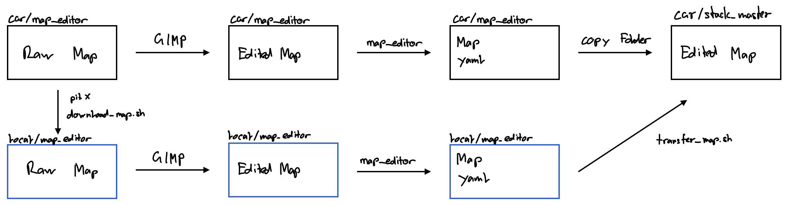

# Map Editor

<!-- Mapping Workflow:  -->

## Editing on your local PC
1. Launch mapping **on the car** with:
    ```bash
    roslaunch map_editor map_editor.launch map_name:=PLACE_DATE_VN map_editor_mapping:=True
    ```
    We follow this convention when naming maps, but in principle any reasonable string name without whitespace should work.

    - Replace `PLACE` with the place where the track is, e.g. icra or hangar
    - Replace `DATE` with the zero-padded current day, e.g. 2805 if it is the 28th of May
    - Replace `VN` with the version of the map, e.g. v0 if it is the first version of the map on that day

    Drive until the map is sufficiently explored (clear trackbounds, no shifts). You can stop anywhere

    Press `y`. This will save a baseline map (png, yaml) and pbstream file **on the car** at the directory `race_stack/f110_utils/nodes/map_editor/maps`.

2. Copy map **from the car to your PC**:
    ```bash
    pitX    # source ros_master_ip for the relevant remote car
    bash stack_master/scripts/download_map.sh $MAP_NAME # fill in map_name accordingly
    ```
    Note that `pitX` is an alias for convenience, defined [here](../../../stack_master/checklists/PitUsage.md).

    If you've somehow forgotten what maps there are, calling `download_map.sh` without arguments lists the maps in the map_editor folder **on the car**.

    This downloads the previously-created map folder **from the car to your PC** in the directory `race_stack/f110_utils/nodes/map_editor/maps`.

    You may be prompted to login on the car. To save time, ensure that the [networking setup](../../../stack_master/checklists/networking.md) here is done.

3. Open up the map **on your PC** and manually edit the `.png` file in GIMP or similar. It **should be overwritten** and not be renamed.

    If `pf_map.png` needs to be edited, do so as well. Remember that `pf_map` **must look like the real track!** This ensures that localization for *SynPF* remains accurate.

4. Call the map_editor program **on your PC**:
    ```bash
    roslaunch map_editor map_editor.launch map_name:=PLACE_DATE_VN map_editor_mapping:=False
    ```

    Now a window with the map should be prompted. Inspect that it makes sense. To proceed that window needs to be closed.

    Next the windows should be prompted that let you select the speed and overtaking sectors.

    Note: In the global trajectory window an arrow is appearing that sets the driving direction. If it is not in the intended direction, add the flag `reverse:=True` to the previous used command.

    ```bash
    roslaunch map_editor map_editor.launch map_name:=PLACE_DATE_VN map_editor_mapping:=False reverse:=True
    ```

    This command will create the `speed_scaler.yaml`, `ot_sectors.yaml`, and `global_waypoints.json` files.

5. Copy map with additional information **from your PC to the car**:
    ```bash
    pitX    # source ros_master_ip for the relevant remote car
    bash stack_master/scripts/transfer_map.sh $MAP_NAME # fill in map_name accordingly
    ```
    This uploads the map folder with the additional metadata **from your PC to the car** in the directory `race_stack/stack_master/maps`.

    This will also copy over the speed scaler and overtaking sector YAML files, and perform an auto-catkin build.

6. Congrats, you should be done. Verify by running base_system **on the car** with the new map.

## Editing on the car

1. Launch mapping **on the car** with:
    ```bash
    roslaunch map_editor map_editor.launch map_name:=PLACE_DATE_VN map_editor_mapping:=True
    ```
    For `PLACE_DATE_VN`, follow the same naming conventions as above. Mapping also follows the same steps.

2. Open up the map and manually edit the `.png` file in GIMP or similar. It **should be overwritten** and not be renamed.

    You can still run GIMP **locally** and access the file using `sftp://race_crew@car_IP` with Files in Ubuntu.

    If `pf_map.png` needs to be edited, do so as well. Remember that `pf_map` **must look like the real track!**

3. Call the map_editor program **on the car**:
    ```bash
    roslaunch map_editor map_editor.launch map_name:=PLACE_DATE_VN map_editor_mapping:=False
    ```

    Now a window with the map should be prompted. Inspect that it makes sense. To proceed that window needs to be closed.

    Next the windows should be prompted that let you select the speed and overtaking sectors.

    Note: In the global trajectory window an arrow is appearing that sets the driving direction. If it is not in the intended direction, add the flag `reverse:=True` to the previous used command.

    ```bash
    roslaunch map_editor map_editor.launch map_name:=PLACE_DATE_VN map_editor_mapping:=False reverse:=True
    ```

    This command will create the `speed_scaler.yaml`, `ot_sectors.yaml`, and `global_waypoints.json` files.

4. Copy map with additional information **from the `map_editor` folder to the `stack_master` folder**:
    ```bash
    bash stack_master/scripts/transfer_map.sh $MAP_NAME # fill in map_name accordingly
    ```
    This transfers the map folder with the additional metadata **from the `map_editor` folder to the `stack_master` folder** in the directory `race_stack/stack_master/maps`.

    This will also copy over the speed scaler and overtaking sector YAML files, and perform an auto-catkin build.

5. Congrats, you should be done. Verify by running base_system **on the car** with the new map.

---
[Go back to the utils list](../../README.md)