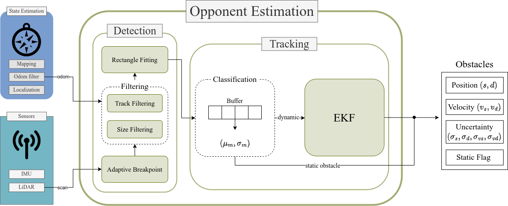

# Opponent Detection & Tracking

This directory contains the Opponent Detection & Tracking system of the ForzaETH F110 Team. The Opponent Detection system is divided into two main components, namely the Opponent Detection and the Opponent Trackeing subsystems.  
The Opponent Detection system is only executed when the car is in headtohead mode. After a successful launch, you should see the following messages from the Perception system:
- `[Opponent Detection]: Ready`
- `[Opponent Tracking]: Ready`

## Overview
This section provides a short overview of the two subsystems.
### Opponent Detection
This system detects obstacles on the racetrack. For this, the laser scans are segmented into smaller objects, which are then filtered based on their size and position. A rectangle fitting method is applied for better feature extraction. The detected obstacles are then passed to the `Opponent Tracking` algorithm.

### Opponent Tracking
The tracking algorithm keeps track of the detected obstacles and associates them. Furthermore, it classifies the obstacles into the classes `static` and `dynamic` based on their standard deviation. In the last step, a prediction for the obstacles is made. For `static` obstacles, a simple averaging method is applied, while the prediction for `dynamic` obstacles is made with a Kalman Filter.

## Dynamic Reconfigurable Parameters
There are several parameters that can be dynamically reconfigured. Parameters can be changed using `ros2 param set [node] [parameter] [value]`.
A short overview of the reconfigurable parameters:
### Opponent Detection
- `min_obs_size`: Minimum size of the point cloud in `#laser_points`. Is used to filter FP.
- `max_obs_size`: Maximum size of an object in `meters`. Is used to filter FP.
- `max_viewing_distance`:  The maximum range for which obstacles can be detected. Currently, the maximum range allowed at F1TENTH is 10m.
- `boundaries_inflation`: This parameter artificially increases the thickness of the track boarders. Can help to filter FP along the boundaries.

### Opponent Tracking
- `ttl_dynamic`: The time-to-live of the dynamic prediction for the opponent obstacle.
- `ratio_to_glob_path`: The ratio between the target velocity of the opponent obstacle and the global velocity (i.e., the velocity of our car). Defines to which target speed the dynamic prediction will convert. If set to 1, the target velocity is equal to the race line speed.
- `ttl_static`: The time-to-live for static and not-classified obstacles. Be aware that the TTL of static obstacles is only decreased if they are visible. This is not the case if `noMemoryMode` is set to `TRUE`
- `min_nb_meas`: Minimum number of measurements of a given obstacle before it gets classified as either static or dynamic.
- `dist_deletion`: Distance up to which obstacles can be deleted.
- `dist_infromt`: Distance up to which obstacles in front of the car are published.
- `min_std`: Standard deviation of the (s,d) position up to which obstacles are classified as static. Needs to be increased when using SynPF.
- `max_std`: Standard deviation of the (s,d) position above which obstacles are immediately classified as dynamic. Needs to be increased when using SynPF.
- `vs_reset`: Average velocity under which dynamic obstacles get reset to static.
- `aggro_multi`: A multiplier for the association distance for dynamic obstacles. 
- `debug_mode`: Will enable some outputs to the console for debugging.
- `publish_static`: When set to `FALSE`, static obstacles will no longer be published. Can help in races with a lot of FP.
- `noMemoryMode`: When set to `TRUE`, obstacles will not be stored, and only the currently visible obstacles are published. Can help in races. 

## Other Parameters
This is a brief explanation of parameters, which are not dynamically reconfigurable. They can be found in `stack_master/config/opponent_tracker_params.yaml`
### Opponent Detection
- `rate`: The rate at which the node is running.
- `lambda`: The minimum reliable detection angle in `degrees`.
- `sigma`: The standard deviation for the noise of the LiDAR ranges in `meters`.
- `min_2_points_dist`: The minimum distance between two LiDAR points. 

### Opponent Tracking
- `rate`: The rate at which the node is running.
- `P_d`: Kalman Filter proportional gain for the distance in d direction
- `P_vs`: Kalman Filter proportional gain for the velocity in s direction
- `P_vd`: Kalman Filter proportional gain for the velocity in d direction
- `measurment_var_s`: The variance of the measurement noise in the s direction.
- `measurment_var_d`: The variance of the measurement noise in the d direction.
- `measurment_var_vs`: The variance of the measurement noise for the velocity in s direction.
- `measurment_var_vd`: The variance of the measurement noise for the velocity in d direction.
- `process_var_vs`: The variance of the process velocity noise for the velocity in s direction.
- `process_var_vd`: The variance of the process velocity noise for the velocity in d direction.
- `max_dist`: The maximal distance for the association of obstacles.
- `var_pub`: Obstacles that have a higher variance will not be published.