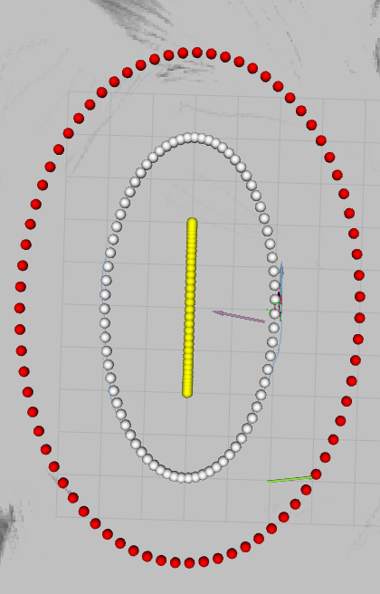

# Checklist for System Identification

## Setting Up ID Analyser

The Analyser is found in the ```race_stack/system_identification/id_analyser``` folder.

For the analyser you need bagpy, as bagpy only works in python 3, but you might be running python2, create a virtual environment following this guide:
```
https://code.visualstudio.com/docs/python/environments
```
which boils down to doing the following <strong>in the id_analyser folder</strong>:
```shell
sudo apt-get install python3-venv
# move to the current folder 
cd /home/icra_crew/catkin_ws/src/race_stack/system_identification/id_analyser/
# create a new virtual environment
python3 -m venv .venv
```
Then install the python extension for vscode and open the command palete using ```Ctrl+Shift+P``` and search for
"Python: Select Interpreter". If the interpreter does not show up, just manually select it (.venv/bin/python)

Then install bagpy and anything else that might be required.

```shell
source /home/icra_crew/catkin_ws/src/race_stack/system_identification/id_analyser/.venv/bin/activate 
pip install wheel importlib-resources tk bagpy 
```

## Physical System Identification

Parameters that need to be identified physically are:
- I_z: Moment of Inertia around yaw axis - Bifilar Pendulum experiment
- h_cg: Height of the center of gravity over the wheel axes
- l_f: distance of front axis from center of mass
- l_r: distance of rear axis from center of mass
- l_wb: wheelbase, should be l_r + l_f
- m: mass of the model

Typically these don't change significantly and need to be identified only once. If a new model is added, generate a model file using the script in the id_analyser [add_model](../../system_identification/id_analyser/add_model.py).

## Steering Angle to Servo Position [Verify or Identify before Tire Identification]

The parameters that are affected by this are found in 
```f1tenth_system/racecar/racecar/config/<NUCX>/vesc.yaml```. We need to set 

```
steering_angle_to_servo_gain: # e.g. -0.8390
steering_angle_to_servo_offset: # e.g. 0.405 
```

This mapping should already be identified correctly. This can be checked by doing the following:

### Verify: Driving Straight

1. Launch the base system with the correct racecar version
```roslaunch racecar pbl_teleop.launch racecar_version:=NUC2 ```

2. Drive straight
  2.1 If the car drives to the right: decrease ```steering_angle_to_servo_offset```
  2.2 If the car drive to the left: increase ```steering_angle_to_servo_offset```
  2.3 There is always some small error due to servo deadzones.
  2.4 This can also be done by tightening os loosening the steering links on the car

3. Repeat Step 2 until satisfied

After finding the correct offset, and setting it in the ```vesc.yaml``` file, navigate to the ```system_identification/id_analyser/models/<NUCX>``` folder. In the two model files you find in there, set ```C_0d``` to the ```steering_angle_to_servo_offset``` you just identified.

### Verify: Steering Angle Gain

In the ```system_identification/id_analyser/models/<NUCX>/<NUCX>_linear.txt``` file you will find a parameter called ```l_wb```, this is the wheelbase of the car. Assuming ackermann steering, we can estimate how large a driven circle should be given a certain steering angle. The formula is:
```Circle_Radius = Wheelbase / tan(Steering_Angle)``` 

You can command a constant steering angle using the ```id controller```. Navigate to ```system_identification/ic_controller/parameters``` and open ```experiments.yaml```. We will only use experiment number ```5```, in which the car drives with a constant speed defined by the ```const_speed``` parameter and changes the steering angle from ```start_angle``` to ```end_angle``` over the time ```angle_time```. From previous tests we know that the maximum steering angle is around +-0.4. 

By setting the start and end angles to the same value the car will drive with a constant steering angle and speed for angle_time duration. 

To test if the steering to servo position gain is correct do the following:
1. Set the const_speed to 1.5, set the start and end angles to 0.1 -> Car will drive a left hand circle
2. Calculate the circle radius the car should drive at with a steering angle of 0.1. 
3. Measure out a circle with with radius and mark the start position of the car and where it should drive through
4. Start the base system like above
```roslaunch racecar pbl_teleop.launch racecar_version:=NUC4 ```
5. Start the id_controller with ```roslaunch id_controller id_controller.launch experiment:=5```
6. Hold the top right button on the remote to make the car follow the commands from the id controller. 
7. Check if the radius of the driven circle matches the marked positions:
  7.1 If the Radius was too big, increase the ```steering_angle_to_servo_gain``` (more negative, e.g. -0.8 -> -0.85) 
  7.2 If the Radius was too small, decrease the ```steering_angle_to_servo_gain``` (less negative, e.g. -0.8 -> -0.75) 

8. Repeat above steps until it drives the circle like you would want it to. Also try out with a negative steering angle: -0.1 -> Car will drive a righthand circle

9. If, after this procedure, you changed the parameters in the `vesc.yaml` file, change them in the corresponding models of the car. You will find the two files in the following position:
- `race_stack/system_identification/id_analyser/models/<NUCX>/<NUCX>_linear.txt`
- `race_stack/system_identification/id_analyser/models/<NUCX>/<NUCX>_pacejka.txt`
`steering_angle_to_servo_gain` corresponds to `C_d` and `steering_angle_to_servo_offset` corresponds to `C_0d`.

### Data-driven Identification of Steering Angle Parameters 

To do this, we need to generate data first. For this:
1. In a terminal navigate to  ```~/catkin-ws/src/race_stack/system_identification/id_anaylser``` and if it doesn't exist yet, make the folders ```data/<NUCX>/steering_angle```. 
2. Go into the ```steering_angle``` folder you just created and <strong>prepare</strong> the command to record a rosbag: ```rosbag record -a -x "scan"```
3. In another terminal, start the base system: ```roslaunch racecar pbl_teleop.launch racecar_version:=<NUCX> se_version:=new```
4. Manually drive a circle driving at a constant speed and steering angle, record rosbag as soon as you reach a steady state and stop rosbag before you stop driving / change steering angle.
5. Repeat step 4. a few times, driving circles with different radii, recording a new rosbag each time.

To analye the data, navigate to the ```~/catkin_ws/src/race_stack/system_identification/id_analyser``` folder and open ```analyse_steering.py```. Set ```model_name_``` to the model that you want to edit. The models are located in the ```models``` subdirectory. 

Open a terminal in vscode and select the virtual environment set up above as python interpreter. Then run the following command to analyse the data:
```python3 analyse_steering.py```

The script will print the parameters that it estimated and will also update them in the model ```.txt```. All that is left to do it to copy the identified  ```C_0d``` to ```steering_angle_to_servo_offset``` and ```C_d``` to ```steering_angle_to_servo_gain``` in the ```vesc.yaml``` for the car.

## Tire Dynamics 

<strong>This should be done for new floors or Tires!!</strong> 
Make sure that the steering angle to servo mapping is identified before.

## Extensive and exact version (do this if possible):

To find the tire parameters, we need to make the car drive at different slip angles. To do this, use the id_controller to make the car drive at a constant speed and slowly ramp up the steering angle. 

0. Make a new folder ```~/catkin_ws/src/race_stack/system_identification/id_analyser/data/<NUCX>/tire_dynamics```, record subsequent bags in that folder
1. Start the Base system: ```roslaunch racecar pbl_teleop.launch racecar_version:=<NUCX> se_version:=new```
2. Set the experiment parameters in ```~/catkin_ws/src/race_stack/system_identification/id_controller/parameters/experiments.yaml```:
    1. angle_time: 20, const_speed: 3, start_angle: 0.1, end_angle: 0.4 <-- left hand turn, car will drive circle with 12m diameter and converge to the left of start position
    2. angle_time: 20, const_speed: 4, start_angle: 0.1, end_angle: 0.4
    3. angle_time: 10, const_speed: 5, start_angle: 0.1, end_angle: 0.4
    4. angle_time: 10, const_speed: 5, start_angle: -0.1, end_angle: -0.4 <-- right hand turn, car will drive circle with 12m diameter and converge to the right of start position
    5. angle_time: 20, const_speed: 4, start_angle: -0.1, end_angle: -0.4
    6. angle_time: 20, const_speed: 3, start_angle: -0.1, end_angle: -0.4
3. Start the experiment with 
```
roslaunch id_controller id_controller.launch experiment:=5
```
4. Hold the button on the remote to make the car drive
4. In another terminal open the data folder you just made and start recording a rosbag as soon as the car has reached a steady state: 
```
rosbag record -a -x "scan"
```
5. The terminal with the experiment will notice you when the experiment is about to be over: "Ending soon, stop the bag" <-- Do so
6. Repeat 2 - 5 with all different settings in step 2.
7. Open ```~/catkin_ws/src/race_stack/system_identification/id_analyser/analyse_tires.py```and change the model name to the one that you are working on (e.g. NUC2_pacejka)
8. Run the script: 
``` 
source .venv/bin/activate
python3 analyse_tires.py
```
9. Change the name to the linear version of the model, to also save and fit the linear tire parameters

## Lookup Table

After identifying the parameters, the lookup table for the model can be generated automatically. For this open ```~/catkin_ws/src/race_stack/system_identification/id_analyser/generate_lookup_table.py``` and change the model name to the model that you would like to generate the lookup table for. Then run the script:
``` 
source .venv/bin/activate
python3 generate_lookup_table.py
```

The lookup table will be generated and saved as CSV in the ```id_analyser/models/<NUCX>``` folder. From there you can copy it over to ```system_identification/steering_lookup/cfg```  and name it according to your setting. It can then be used for the MAP controller.

## Lookup Table validation
Drive on the track and compare to other Lookup Tables

To roughly check the quality of the obtained measurement, you can test driving around an ellipse and see if the error is low enough. 

1. position the car in a place with at least 1m space to the right, 5m to the left, 5m in  front and 5m to the back. There is a picture for reference, with car as the blue arrow.

2. launch the SysId verificator:
```
roslaunch stack_master sysid_verify.launch mode:=safe LU_table:=<INSERT CORRECT LUT NAME> 
```
3. Drive around for a couple of laps
4. check in the terminal used for running the test what is the average lap time and what is the average error. In the hangar, [](../launch/sysid_verify.launch) yields ca. 5.95 s for laptime and 0.135 for lateral error. 

## Quick Version (if there is not enough space or time):

In ```~/catkin_ws/src/race_stack/system_identification/id_analyser/model/NUCX/NUCX_pacejka/linear```, change the mu value to represent how much more slippery or grippy the tires are compared to the measured ones. To do this, measure the lateral friction of the car with the Newtonmeter and compare it to the premeasured values in this [table](https://docs.google.com/spreadsheets/u/1/d/1gE8_uCqfD9cIxWgixRcTf_ySR_eO9Na0u2SreVcDfYg/edit?usp=drive_web&ouid=118084018467953082467)

 Then continue with generating the Lookup Table.

## Speed to ERPM Mapping [SHOULD NOT BE REQUIRED]

The parameters that are affected by this are found in 
`race_stack/base_system/f1tenth_system/racecar/racecar/config/<NUCX>/vesc.yaml`. We need to set 

```
speed_to_erpm_gain: # e.g. 4316
speed_to_erpm_offset: #e.g. -5.0
```

This mapping should already be identified correctly. this can be checked by plotting commanded vs measured speed (by slam) in rqt. 


### Data-driven Identification of Motor RPM parameters

We are actually going to <strong>fix the offset to -5.0</strong>, so in fact we only need to identify the ```speed_to_erpm_gain```.
To do this, we need to generate data first. For this:
1. In a terminal navigate to  ```~/catkin-ws/src/race_stack/system_identification/id_anaylser``` and if it doesn't exist yet, make the folders ```data/<NUCX>/motor```. 
2. Go into the motor folder you just created and <strong>prepare</strong> the command to record a rosbag: ```rosbag record -a -x "scan"```
3. In another terminal, start the base system: ```roslaunch racecar pbl_teleop.launch racecar_version:=<NUCX> se_version:=new```
4. Drive straight at a constant velocity, after the car has accelerated to a constant velocity start recording the bag, stop the bag before you stop driving. 
5. Repeat step 4. a few times, driving at different speeds, recording a new rosbag each time.

To analye the data, navigate to the ```~/catkin-ws/src/race_stack/system_identification/id_anaylser``` folder and open ```analyse_motor_rpm.py```. Set ```model_name_``` to the model that you want to edit. The models are located in the ```models``` subdirectory. 

Open a terminal in vscode and select the virtual environment set up above as python interpreter. Then run the following command to analyse the data:
```python3 analyse_motor_rpm.py```

The script will print the parameters that it estimated and will also update them in the model ```.txt```. All that is left to do it to copy the identified  ```C_v``` to ```speed_to_erpm_gain``` in the ```vesc.yaml``` for the car.

## Steering Angle to Servo Position [SHOULD NOT BE REQUIRED]

The parameters that are affected by this are found in 
```f1tenth_system/racecar/racecar/config/<NUCX>/vesc.yaml```. We need to set 

```
steering_angle_to_servo_gain: # e.g. -0.8390
steering_angle_to_servo_offset: # e.g. 0.405 
```

This mapping should already be identified correctly. This can be checked by doing the following:

### Driving Straight

1. Launch the base system with the correct racecar version
```roslaunch racecar pbl_teleop.launch racecar_version:=NUC4 ```

2. Drive straight
  2.1 If the car drives to the right: decrease ```steering_angle_to_servo_offset```
  2.2 If the car drive to the left: increase ```steering_angle_to_servo_offset```
  2.3 There is always some small error due to servo deadzones.
  2.4 This can also be done by tightening os loosening the steering links on the car

3. Repeat Step 2 until satisfied

After finding the correct offset, and setting it in the ```vesc.yaml``` file, navigate to the ```system_identification/id_analyser/models/<NUCX>``` folder. In the two model files you find in there, set ```C_0d``` to the ```steering_angle_to_servo_offset``` you just identified.

### Steering Angle Gain

In the ```system_identification/id_analyser/models/<NUCX>/<NUCX>_linear.txt``` file you will find a parameter called ```l_wb```, this is the wheelbase of the car. Assuming ackermann steering, we can estimate how large a driven circle should be given a certain steering angle. The formula is:
```Circle_Radius = Wheelbase / tan(Steering_Angle)``` 

You can command a constant steering angle using the ```id controller```. Navigate to ```system_identification/ic_controller/parameters``` and open ```experiments.yaml```. We will only use experiment number ```5```, in which the car drives with a constant speed defined by the ```const_speed``` parameter and changes the steering angle from ```start_angle``` to ```end_angle``` over the time ```angle_time```. From previous tests we know that the maximum steering angle is around +-0.4. 

By setting the start and end angles to the same value the car will drive with a constant steering angle and speed for angle_time duration. 

To test if the steering to servo position gain is correct do the following:
1. Set the const_speed to 1.5, set the start and end angles to 0.1 -> Car will drive a left hand circle
2. Calculate the circle radius the car should drive at with a steering angle of 0.1. 
3. Measure out a circle with with radius and mark the start position of the car and where it should drive through
4. Start the base system like above
```roslaunch racecar pbl_teleop.launch racecar_version:=NUC2 ```
5. Start the id_controller with ```roslaunch id_controller id_controller.launch experiment:=5```
6. Hold the top right button on the remote to make the car follow the commands from the id controller. 
7. Check if the radius of the driven circle matches the marked positions:
  7.1 If the Radius was too big, increase the ```steering_angle_to_servo_gain``` (more negative, e.g. -0.8 -> -0.85) 
  7.2 If the Radius was too small, decrease the ```steering_angle_to_servo_gain``` (less negative, e.g. -0.8 -> -0.75) 

8. Repeat above steps until it drives the circle like you would want it to. Also try out with a negative steering angle: -0.1 -> Car will drive a righthand circle

9. If, after this procedure, you changed the parameters in the `vesc.yaml` file, change them in the corresponding models of the car. You will find the two files in the following position:
- `race_stack/system_identification/id_analyser/models/<NUCX>/<NUCX>_linear.txt`
- `race_stack/system_identification/id_analyser/models/<NUCX>/<NUCX>_pacejka.txt`
`steering_angle_to_servo_gain` corresponds to `C_d` and `steering_angle_to_servo_offset` corresponds to `C_0d`.


### Data-driven Identification of Steering Angle Parameters 

To do this, we need to generate data first. For this:
1. In a terminal navigate to  ```~/catkin-ws/src/race_stack/system_identification/id_anaylser``` and if it doesn't exist yet, make the folders ```data/<NUCX>/steering_angle```. 
2. Go into the ```steering_angle``` folder you just created and <strong>prepare</strong> the command to record a rosbag: ```rosbag record -a -x "scan"```
3. In another terminal, start the base system: ```roslaunch racecar pbl_teleop.launch racecar_version:=<NUCX> se_version:=new```
4. Manually drive a circle driving at a constant speed and steering angle, record rosbag as soon as you reach a steady state and stop rosbag before you stop driving / change steering angle.
5. Repeat step 4. a few times, driving circles with different radii, recording a new rosbag each time.

To analye the data, navigate to the ```~/catkin_ws/src/race_stack/system_identification/id_analyser``` folder and open ```analyse_steering.py```. Set ```model_name_``` to the model that you want to edit. The models are located in the ```models``` subdirectory. 

Open a terminal in vscode and select the virtual environment set up above as python interpreter. Then run the following command to analyse the data:
```python3 analyse_steering.py```

The script will print the parameters that it estimated and will also update them in the model ```.txt```. All that is left to do it to copy the identified  ```C_0d``` to ```steering_angle_to_servo_offset``` and ```C_d``` to ```steering_angle_to_servo_gain``` in the ```vesc.yaml``` for the car.

## Acceleration to Current Gain [SHOULD NOT BE REQUIRED]
<strong>This is only needed when controlling the cars acceleration directly and not through the VESC</strong> 

0. Make a new folder ```~/catkin_ws/src/race_stack/system_identification/id_analyser/data/<NUCX>/accel```, record subsequent bags in that folder
1. Start the Base system: ```roslaunch racecar pbl_teleop.launch racecar_version:=<NUCX> se_version:=new``` and make sure that you have at least 20m of free space in front of the car.
2. Set the experiment parameters in ```~/catkin_ws/src/race_stack/system_identification/id_controller/parameters/experiments.yaml```:
   1. const_accel = 2, const_decel = 2
   2. const_accel = 4, const_decel = 4
   3. const_accel = 6, const_decel = 6
3. In another terminal open the data folder you just made and prepare for recording a rosbag.
```
rosbag record -a -x "scan"
```
4. Start the experiment with 
```
roslaunch id_controller id_controller.launch experiment:=3
```
5. Immediately start the rosbag
6. Hold the button on the remote to make the car drive

7. The terminal with the experiment will notice you when the experiment is  over: "Experiment over", so stop the rosbag
8. Repeat 2 - 7 with all different settings in step 2.
9. Open ```~/catkin_ws/src/race_stack/system_identification/id_analyser/analyse_accel.py```and change the model name to the one that you are working on (e.g. NUC2_pacejka)
10. Run the script: 
``` 
source .venv/bin/activate
python3 analyse_tires.py
```
11. Do the same with 
```~/catkin_ws/src/race_stack/system_identification/id_analyser/analyse_decel.py```

12.  In ```~/catkin_ws/src/race_stack/system_identification/id_analyser/models/NUCX/NUCX_pacejka.txt``` look at the parameters C_acc, C_dec and C_R

13. In ```~/catkin_ws/src/race_stack/base_system/f1tenth_system/racecar/racecar/config/NUCX/vesc.yaml```, input the found parameters in the following way:
    
    acceleration_to_current_gain: C_acc 

    deceleration_to_current_gain: C_dec

    velocity_to_current_gain: C_R

14. Verify the parameters by setting the parameters to
```
  const_accel = 2, const_decel = 2
```
and launching ``` roslaunch id_controller id_controller.launch experiment:=3 ``` again. Measure out a 6m long straight and measure the time it takes to drive across from standing still. Calculate the acceleration by $a = 2* distance/t²$. Adjust Accel and Decel Gain if needed.


