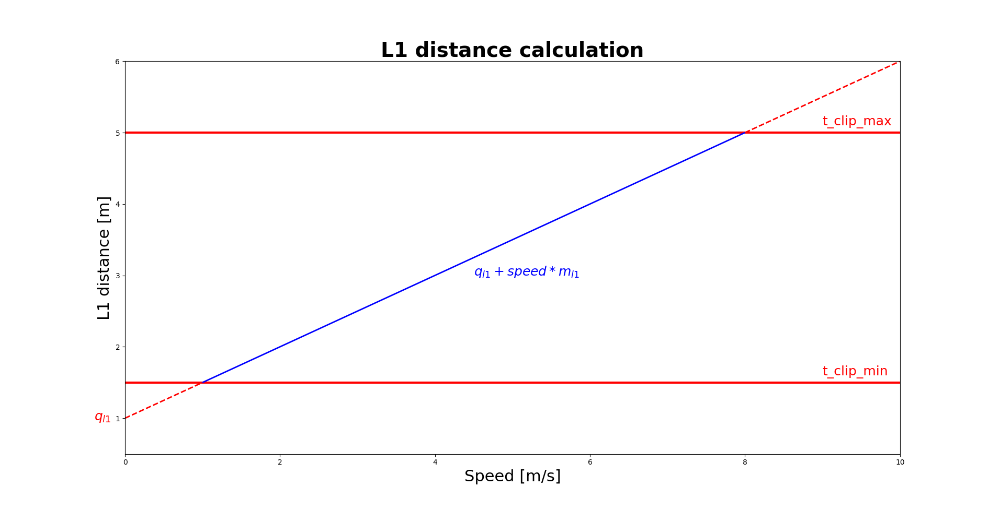
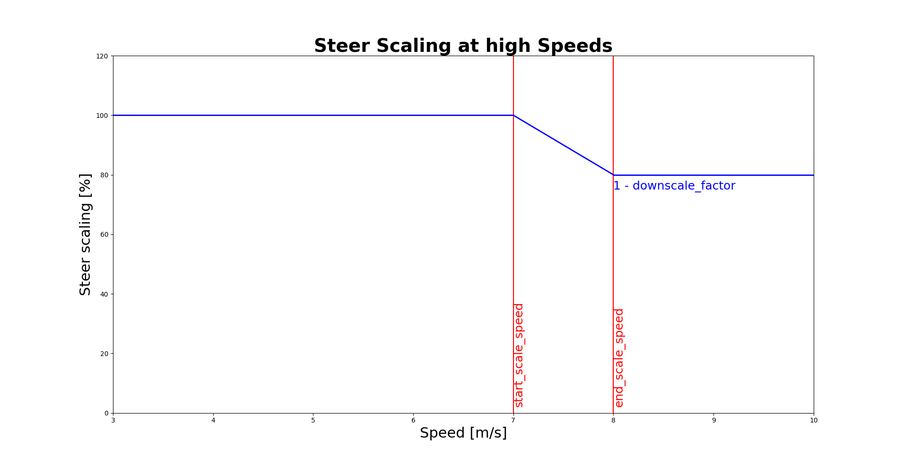

# Config
The config folder is your one stop shop for all the parameters attached to your specific car. E.g. every car will have it's own specific servo steering offset and so on based on the physical hardware. So all parameters are saved in the `config` folder.

## Create a new car
We provide some examples [`Jet1`, `NUC2`, `SIM`] which you can copy and name it after your car and then tune your parameters as desired. The `SIM` car refers to the tire dynamics etc of the car used in the simulator. Typically the following parameters are necessary to be adjusted:
- `config/NAME_OF_CAR/vesc.yaml`, for tuning follow the following guide from [MuSHR](https://mushr.io/tutorials/tuning/):
  - `speed_to_erpm_gain`, this depends on your VESC PID tuning
  - `speed_to_erpm_offset`, this depends on your VESC PID tuning
  - `steering_angle_to_servo_offset`, this depends on your physical hardware
  - `steering_angle_to_servo_gain`, this depends on your physical hardware

- `config/NAME_OF_CAR/static_transforms.launch.xml`, When mounting the hardware it is good to remasure if all static transforms are correct 
- `config/NAME_OF_CAR/slam/f110_2d_loc.lua`, this defines the specific slam parameters to be used for each car, as each LiDAR is slightly different and the accuracy of your wheel odometry tuning.
  - `TRAJECTORY_BUILDER_2D.ceres_scan_matcher.rotation_weight`, depends on the accuracy of your wheel odometry
  - `TRAJECTORY_BUILDER_2D.ceres_scan_matcher.translation_weight`, depends on the accuracy of your wheel odometry
  - `MAP_BUILDER.num_background_threads`, depends on your compute power
  - `TRAJECTORY_BUILDER_2D.submaps.num_range_data = 80`, this depends on your computer's computational power
  - `POSE_GRAPH.optimize_every_n_nodes = 5`, this depends on your computer's computational power

## MAP Controller 
The MAP controller can be found in `/race_stack/controller/map/src/MAP_Controller.py`, the tuning Parameters differ from car to car and can be tuned using dynamic reconfigure. It is not necessary to tune these parameters as the default values should work on every track. However by tweaking the values to a specific track a slightly better performance can be achieved. It is also necessary to perform the tuning when a car is modified heavily (suspension, tires, weight) or when driving on a new car.
### Parameter description

  - MAP distance parameters
    - `t_clip_min`: minimum l1 distance
    - `t_clip_max`: maximum l1 distance
    - `m_l1`: slope l1/velocity relation 
    - `q_l1`: intercept of l1/velocity relation
   

  - Forward propagation for the speed lookup:
    - `speed_lookahead`: time [s] of forward propagation with constant velocity 
  - Forward propagation for the steering angle
    - `speed_lookahead_for_steer`: time [s] of forward propagation with constant velocity for the location used for the steer (MAP)
  - the acceleration scalers, for accounting for load shift in acc/braking, increase/decrease the steering angle by a factor
    - `acc_scaler_for_steer`
    - `dec_scaler_for_steer`
  
  - the coefficient to account for lateral error when doing speed control 
    - `lat_err_coeff`: 0 means no account for lateral error, 1 means maximum accounting
  - scalers for high speed
    - `start_scale_speed`: up to this speed the steer is normal
    - `end_scale_speed`: from this speed on the steer is scaled by 1 - `downscale_factor` and in between it linearly decreases down
    - `downscale_factor`: speed is reduced by this factor
  

 ### Tuning Procedure
1. MAP distance Parameters for new car/components (should not be necessary on raceday)
   
    Set up a track where the car can safely drive up to $4$ m/s (no sharp corners). Map the track and start a time trials session with the driving speed to constant $2$ m/s. Set `m_l1` and `q_l1` to zero and `t_clip_max` to a high number. With that we make sure, that the L1 distance is kept constant at the value of `t_clip_min`. 

    While driving slowly increase `t_clip_min` until the car doesn't oscillate anymore. Save this number for later as $D_2$.

    Now set the driving speed to $4$ m/s and repeat the same process. Save the number set in `t_clip_min` as $D_4$.

    With these two datapoints gathered, we will interpolate to get the linear function representing the l1/velocity relation. It is possible to repeat the process with different velocities if necessary. 

    The parameters can be set as follows: 

   - `t_clip_max` = $5$ (the car should never look ahead more than 5 meters)
   - `m_l1` = $\frac{D_4-D_2}{2}$
   - `q_l1` = $D_2 - 2*$ `m_l1`
   - `t_clip_min` = $D_2 - 1*$ `m_l1` (as the car will never drive slower than 1 m/s)

2. MAP distance Parameters at the Race
   
    Start out with the set parameters found with the process described in (1)

    `t_clip_min` and `t_clip_max` should not be changed unless the track is extremely fast or slow.
    If the car tends to cut corners decrease `q_l1` and/or `m_l1`, if it oscillates increase them. 
    Proven good values are `m_l1 = 0.5`, `q_l1 = 0.2`

3. Scalers for high speeds
  
    These could be tuned by driving the same track/corners at higher and higher constant speeds and and setting `start_scale_speed` to the point where the car starts to turn to much for it's velocity. And lower the steering from that velocity onward by `downscale_factor`. However this is probably not necessary to do.

4. Accelerating scaler
   
    For `acc_scaler_for_steer` and `dec_scaler_for_steer` start out with both values at $1$

    Increase the `acc_scaler_for_steer` slowly, looking at the laptime and average/max lateral error. Increase until the values stop improving or you see the car skidding. It is generally good to keep the values in the range $[1,1.5]$

    Keep the `acc_scaler_for_steer` at the found value and slowly decrease `dec_scaler_for_steer`, looking at the laptime and average/max lateral error. Decrease until the values stop improving. It is generally good to keep the values in the range $[0.7,1]$

5. `speed_lookahead` is normally set at $0.25$, this should work. If you need to tune it, it should be kept in the range $[0,0.5]$. With larger values the car tracks better, but the laptime gets slower.
   
6.  To tune the  `lat_err_coeff`, set up some obstacles on the track and start a head to head session. Make sure to activate overtaking on all sectors. Starting with a value of 1 slowly decrease the value as long as the laptime gets faster and the car can still overtake safely.
7.  `speed_lookahead_for_steer` can be increased to make the car cut corners to increse laptime. This can get very dangerous fast. Slowly increase the value while looking at how close the car is to corners. Keep this in the range $[0,0.2]$, $0.05$ is probably realistic.

