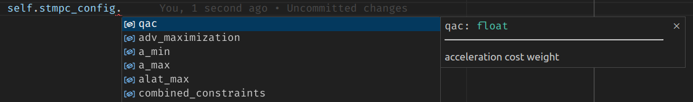

# PBL Config
This package defines the (new) configs for the ForzaETH race_stack used at PBL.
It is based on a strict definition of the the schema of the config files, via the `pydantic` library, that strictly enforces that yaml files contain exactly the same parameters as described in the schema. This is done to avoid errors due to typos or missing parameters in the config files.
Furthermore, the package provides a set of utility functions to load the config files, allows for autocompletion in VSCode and further facilitates the creation of dynamically reconfigurable parameters.


## Tutorial
The following tutorial will guide you through the steps of defining a new config schema, loading it, using it in your code, and creating a dynamically reconfigurable parameter server automatically.
It will follow the working code of the [`STMPCConfig.py`](./src/pbl_config/controller/mpc/STMPCConfig.py) file in the `pbl_config` package.

### Create a config schema and use it in your code
To create a new schema, subclass the `BaseModel` class from the `pydantic` library and define the parameters as class attributes.

```python
from pydantic import BaseModel, ConfigDict, ValidationError

class STMPCConfig(BaseModel):
    """Single track MPC configuration class"""
    model_config = ConfigDict(extra='forbid', use_attribute_docstrings=True)

    # general parameters
    N: int
    """Prediction horizon"""
    t_delay: float
    """Delay in seconds accounted for propagation before the MPC is applied"""
```

Two configurations are here used for the config:
- `extra='forbid'`: This will raise an error if the config file contains any additional parameters that are not defined in the schema.
- `use_attribute_docstrings=True`: This will use the docstrings of the class attributes as descriptions in the config file. This is particularly handy for creation of dynamic reconfigurable parameters.

Then a custom loading function is defined to load the config file and validate it against the schema.
```python
def load_STMPC_config_ros(racecar_version: str) -> STMPCConfig:
    """Loads the MPC config from the yaml file

    Args:
        racecar_version (str): a car name
    """

    relative_path = '/config/' + racecar_version + '/single_track_mpc_params.yaml'
    config_path = rospkg.RosPack().get_path('stack_master') + relative_path
    with open(config_path, 'r') as file:
        cfg_dict = yaml.safe_load(file)
        try:
            config = STMPCConfig(**cfg_dict)
        except ValidationError as e:
            for error in e.errors():
                if error["type"] == "missing":
                    for missing_key in error["loc"]:
                        print(f"Missing key <{missing_key}> in {config_path} file. Please add it.")
                elif error["type"] == "extra_forbidden":
                    for extra_key in error["loc"]:
                        print(f"Extra key <{extra_key}> in {config_path} file. Please remove it.")
                else:
                    print(f"Error loading the {config_path} file. Please contact support (edo) with this traceback.")
                    raise e
            return None

    return config
```
This function loads the config file first from the `yaml` file and then validates it against the schema with the `try-except` block, specifically catching the `pydantic` exception.
If the config file is not valid, it will print the missing or extra keys and return `None`.

With such a function, the config can just be defined in a `yaml` file with the `key: value` pairs:
```yaml
# single_track_mpc_params.yaml3
N: 10
t_delay: 0.1
```
And it can be loaded in the code, as for example in [controller_manger.py](../../controller/controller_manager.py):
```python
# ../controller/mpc/STMPCConfig.py
from pbl_config import load_STMPC_config_ros, STMPCConfig

...
class ControllerManager:
    def __init__(self):
        ...
        self.mpc_config = load_STMPC_config_ros(self.racecar_version)
        ...
```
This clearly needs to be done by installing the `pbl_config` package as a python package, which can be added to the `catkin build` procedure by adding a [`setup.py`](../setup.py) and adding the following line to the [`CMakeLists.txt`](../CMakeLists.txt):
```cmake
...
catkin_python_setup()
...
```
If the position of the source code of the package is then added to the `.vscode/settings.json` file, the autocompletion will work in VSCode.
```json
{
    "python.autoComplete.extraPaths": [
        "/home/${env:USERNAME}/catkin_ws/src/race_stack/stack_master/pbl_config/src",
    ],
    "python.analysis.extraPaths": [
        "/home/${env:USERNAME}/catkin_ws/src/race_stack/stack_master/pbl_config/src",
    ]
...
}
```


### Create a dynamically reconfigurable schema and automate the parameter server creation
To then create a dynamically reconfigurable parameter server, we create another schema for the dynamically reconfigurable parameters:
```python
class STMPCConfigDyn(BaseModel):
    """Single track MPC dynamic reconfigure configuration class"""
    model_config = ConfigDict(extra='forbid', use_attribute_docstrings=True)

    t_delay: Tuple[float, float]
    """Delay in seconds accounted for propagation before the MPC is applied"""
```
Notice that the `t_delay` parameter is now a `Tuple[float, float]`, which means that it is a tuple of two floats. This is used to define the range of the parameter in the dynamic reconfigure server.

Then a custom loading function is defined to load the dynamic reconfigurable parameters from the config file and create the parameter server:
```python
from dynamic_reconfigure.parameter_generator_catkin import ParameterGenerator
...
def create_STMPC_dynamic_parameters(gen: ParameterGenerator):
    """Create dynamic reconfigure parameters for the single track MPC controller

    Args:
        gen (ParameterGenerator): The dynamic reconfigure parameter generator
    """
    default_car = "DEFAULT"
    # load default parameters from the yaml file
    MPCconfig: STMPCConfig = load_STMPC_config_ros(racecar_version=default_car) # using the default_car version by default

    # load the dynamic reconfigure parameters
    relative_path = f'/config/{default_car}/single_track_mpc_dyn_params.yaml'
    config_path = rospkg.RosPack().get_path('stack_master') + relative_path
    with open(config_path, 'r') as file:
        cfg_dict = yaml.safe_load(file)
    try:
        config = STMPCConfigDyn(**cfg_dict)
    except ValidationError as e:
        for error in e.errors():
            if error["type"] == "missing":
                for missing_key in error["loc"]:
                    raise ValueError(f"Missing key <{missing_key}> in {config_path} file. Please add it.")
            elif error["type"] == "extra_forbidden":
                for extra_key in error["loc"]:
                    raise ValueError(f"Extra key <{extra_key}> in {config_path} file. Please remove it.")
            else:
                raise ValueError(f"Error loading the {config_path} file. Please contact support (edo) with this traceback.")
        return None

    # check dyn parameters are available in the normal config
    for key in config.model_dump().keys():
        if key not in MPCconfig.model_dump().keys():
            raise ValueError(f"Key <{key}> is not available in the normal config. Please only try to dynamically reconfigure only the available parameters.")

    # create the dynamic reconfigure parameters
    for key, value in config.model_dump().items():
        gen.add(name=key,
                paramtype='double',
                level=0,
                description=f"{config.model_fields[key].description}",
                default=MPCconfig.model_dump()[key],
                min=value[0],
                max=value[1],
        )

    return gen
```
Let's break this down piece by piece.
The first two lines load the default parameters from the normal config file, as they are later used.
```python
    default_car = "DEFAULT"
    # load default parameters from the yaml file
    MPCconfig: STMPCConfig = load_STMPC_config_ros(racecar_version=default_car) # using the default_car version by default
```

Then the yaml file is loaded and verified in a similar way as for the base config:
```python
    # load the dynamic reconfigure parameters
    relative_path = f'/config/{default_car}/single_track_mpc_dyn_params.yaml'
    config_path = rospkg.RosPack().get_path('stack_master') + relative_path
    with open(config_path, 'r') as file:
        cfg_dict = yaml.safe_load(file)
    try:
        config = STMPCConfigDyn(**cfg_dict)
    except ValidationError as e:
        ...
```
Then, an additional check is performed, to make sure that the dynamic reconfigurable parameters are only a subset of the normal parameters:
```python
    # check dyn parameters are available in the normal config
    for key in config.model_dump().keys():
        if key not in MPCconfig.model_dump().keys():
            raise ValueError(f"Key <{key}> is not available in the normal config. Please only try to dynamically reconfigure only the available parameters.")
```
Finally, the dynamic reconfigurable parameters are created with the `ParameterGenerator` object:
```python
    # create the dynamic reconfigure parameters
    for key, value in config.model_dump().items():
        gen.add(name=key,
                paramtype='double',
                level=0,
                description=f"{config.model_fields[key].description}",
                default=MPCconfig.model_dump()[key],
                min=value[0],
                max=value[1],
        )

    return gen
```
Notice that in this case the `paramtype` is hardcoded to `'double'`, but it could be easily extended to other types. Furthermore, notice that the `description` is taken from the description field of the `pydantic` attribute, which comes from the docstring of the attribute in the schema, another reason why it is important to have the docstrings in the schema.

Finally, the parameter server is created in the `dyn_stmpc_params_tuner.cfg` file, in the `controller` package:
```python
#!/usr/bin/env python3
PACKAGE = "controller"
import rospkg
import yaml, os
import rospy
from dynamic_reconfigure.parameter_generator_catkin import *
from pbl_config import create_STMPC_dynamic_parameters

gen = ParameterGenerator()
gen = create_STMPC_dynamic_parameters(gen)

exit(gen.generate(PACKAGE, "dynamic_stmpc_params", "dyn_stmpc_params_tuner"))
```

Then, the parameter server can be described without the need for hardcoding the parameters in the code, and similarly can the client and the callback that reads the updates.
For the example of the server see [mpc_online_params_server.py](../../controller/mpc/src/mpc_online_params_server.py) and for an example of the client see [controller_manager.py](../../controller/controller_manager.py).

### CPP wrapper
In order to use these configs in a cpp node you need to add a cpp wrapper. Add a header (.h) file to `pbl_config/include/CppWrapper/` and a .cpp file to `pbl_config/src/CppWrapper. In the include file you can define the structure of the config. Be sure to use the same structure as in the python file, otherwise it will break.
```cpp
#ifndef CAR_CONFIG_LOADER_H
#define CAR_CONFIG_LOADER_H
#include <Config.h>


class CarConfig : Config
{
private:
public:
    CarConfig(std::string racecar_version) {
        load_config(racecar_version);
    };
    double m;
    double Iz;
    double lf;
    double lr;
    double h_cg;
    void load_config(std::string racecar_version) override;
};


#endif  // CAR_CONFIG_LOADER_H
```

In the main `.cpp` file you need to add the code that maps the config of the python file to the cpp structure and the call to your python function:
```cpp
#include <CarConfig.h>
#include <pybind11/embed.h>
namespace py = pybind11;

void CarConfig::load_config(std::string racecar_version) {
    py::scoped_interpreter guard{}; // Start the Python interpreter

    py::module car_config_module = py::module::import("pbl_config");  // Import your Python module
    py::object load_car_config_ros = car_config_module.attr("load_car_config_ros");

    py::dict config_dict = load_car_config_ros(racecar_version);  // Call Python function and get the result
    m = config_dict["m"].cast<double>();
    Iz = config_dict["Iz"].cast<double>();
    lf = config_dict["lf"].cast<double>();
    lr = config_dict["lr"].cast<double>();
    h_cg = config_dict["h_cg"].cast<double>();
}
```

Finally add your `.cpp` file to the `stack_master/CMakeLists.txt` file and build the stack_master package:
```Cmake
add_library(stack_master pbl_config/src/pbl_config/CppWrapper/CarConfig.cpp <YOUR_FILE>)
```

To use this Cpp function in a Cpp node you will need to configure the `package.xml` and `CMakeLists.txt` of the package where you want to use it. In the Cmake file you need to add `stack_master` to the `find_package` function and in the `package.xml` file you need to add the following 2 lines:
```xml
  <run_depend>stack_master</run_depend>
  <build_depend>stack_master</build_depend>
  ```

  Now you can use the config like this:
  ```cpp
  #include CarConfig.h

  int main() {
    CarConfig config = CarConfig("NUC5");
    double mass = config.m;
    return 0;
  }
  ```