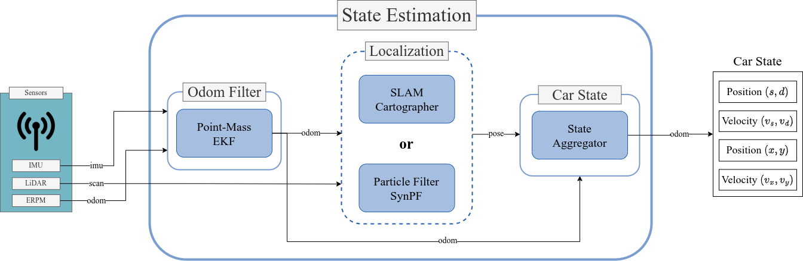

# State Estimation

This directory contains the all required files to launch the state estimation submodule, including Google's *cartographer* localization framework, the Extended Kalan Filter for velocity estimation, and the car state aggregator (*carstate_node*). This includes the relevant launchers, configuration files, and scripts. 

The main launcher for the state estimation components can be found in `state_estimation/launch/state_estimation_launch.xml`. 

## Kalman Filter ##

The Kalman Filter is implemented using the `robot_localization` package published [here](https://github.com/cra-ros-pkg/robot_localization) [see our paper for reference]. 

During operation, the EKF is launched in EKF python launch file, called by the aforementioned main State Estimaiton launch file. The EKF launch file is located in `state_estimation/launch/ekf_launch.py`.

### Parameters

The parameters associated with the EKF can be modified in the configuration file located in `state_estimation/config/ekf.yaml`.

The parameters relevant to the EKF, responsible for generating the velocity estimates, can in this case be subdivided into two categories: the covariances $\sigma_{i}^2 \in [0, \infty)$ associated with observations (zero elements are handled by the *robot_localization* package) and the configuration parameters which dictate what sources are to be considered by the EKF. 
    
The `robot_localization` sensor fusion EKF configuration parameters are defined according to the associated publication as:
    
$$ 
\verb|config| =
\begin{bmatrix}
    x & y & z \\
    roll & pitch & yaw \\
    vx & vy & vz \\
    vax & vay & vaz \\
    alx & aly & alz \\
\end{bmatrix} 
$$

where each entry is of type boolean, indicating whether or not the associated data source should be considered by the filter.

The EKF parameters intended for tuning are summarized as follows:

- $[\sigma_{VESC,x}, \sigma_{VESC,y}, \sigma_{VESC,\psi}] = [0.25, 0.5, 0.4]$ - the covariances associated with VESC control odometry x position, y position, and yaw angle, respectively.
- $[\sigma_{VESC,vx}, \sigma_{VESC,vy}, \sigma_{VESC,vaz}] = [0.02, 0.05, 0.0]$ - the covariances associated with VESC control odometry longitudinal, lateral, and angular yaw velocities, respectively.
- $[\sigma_{IMU,al}, \sigma_{IMU,va}, \sigma_{IMU,q}] = [0.0,0.0,0.0]$ - the covariances associated with IMU linear acceleration, angular velocity, and orientation measurements, respectively.
- The EKF configuration matrix for the VESC control odometry is defined as:
$$
\verb|config_odom| = 
\begin{bmatrix}
    \verb|false| & \verb|false| & \verb|false| \\
    \verb|false| & \verb|false| & \verb|false| \\
    \verb|true| & \verb|true| & \verb|false| \\
    \verb|false| & \verb|false| & \verb|false| \\
    \verb|false| & \verb|false| & \verb|false| \\
\end{bmatrix}
$$
- The EKF configuration matrix for the IMU is defined as:
$$
\verb|config_imu| = 
\begin{bmatrix}
    \verb|false| & \verb|false| & \verb|false| \\
    \verb|false| & \verb|false| & \verb|true| \\
    \verb|false| & \verb|false| & \verb|false| \\
    \verb|false| & \verb|false| & \verb|true| \\
    \verb|false| & \verb|false| & \verb|false| \\
\end{bmatrix}
$$

## Localization ##

With the ROS2 race-stack, you can currently only use Google's *cartographer* localization framework outlined [here](https://google-cartographer-ros.readthedocs.io/en/latest/) [see our paper for reference]. 

The localization package is launched via the aformentioned main state estimation launch file located under `state_estimation/launch/state_estimation_launch.xml`. 

### Parameters

The parameters associated with SLAM localization can be modified in the configuration files located under `stack_master/config/[racecar_version]/slam/`, where `[racecar_version]` is the subfolder corresponding to the vehicle in question. When mapping, edit the `f110_2d.lua` (for Mapping) or `f110_2d_loc.lua` (for Localization) file.

Based on our trust on Odometry values:
- `TRAJECTORY_BUILDER_2D.ceres_scan_matcher.rotation_weight`
- `TRAJECTORY_BUILDER_2D.ceres_scan_matcher.translation_weight`

These weight the cost of rotating/translating incoming scans (from the odometry reference). If we trust our odometry, we can weight these values a little higher, but if not (our IMU and `vesc/odom` values aren't great at the moment) the default values are `0.2`.

- `POSE_GRAPH.optimization_problem.odometry_rotation_weight`
- `POSE_GRAPH.optimization_problem.odometry_translation_weight`

These weight how much the pose graph weights odometry (over scan matching). Similarly to above, but when performing localization of the car. Default values are `0`.

Based on our trust of LIDAR scans:
- `TRAJECTORY_BUILDER_2D.submaps.range_data_inserter.probability_grid_range_data_inserter.hit_probability`
`TRAJECTORY_BUILDER_2D.submaps.range_data_inserter.probability_grid_range_data_inserter.miss_probability`

These weight the probability of a hit or miss in the occupancy grid.
- Hit probability: The trust in cells where we get range data
- Miss probability: The trust in cells where we observe free space

If we don't trust the lidar (eg. black tubes), we should reduce the miss probability (free space may mean undetected things).

