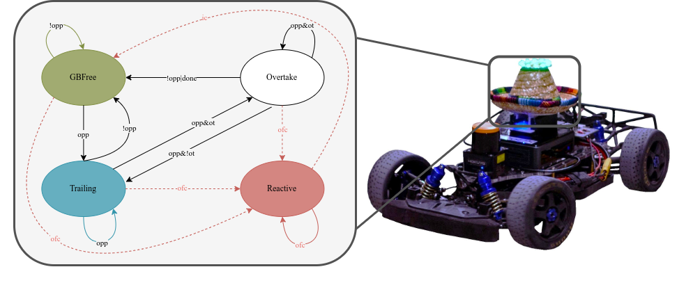

# State Machine

This node implements a state machine to effectively incorparate both `time_trials_launch.xml` behaviors as well as `head_to_head_launch.xml`. 
**TODO:** reintegrate state_indicator

## Description
The main node of the state machine is implemented in [`state_machine.py`](./state_machine/state_machine.py) file. This node is responsible for subscribing/publishing to the necessary topics, and computing the conditions necessary for the state transitions.

The state transistions are implemented in the [`transitions.py`](./state_machine/transitions.py) file, what happens in the states (how the local waypoints are generated for the controller) is implemented in the [`states.py`](./state_machine/states.py) file. 

A simplified version of the state machine is shown in the figure below.

## Parameters
- `lateral_width_gb_m`: Width in meters of the area considered around the global raceline for computing if it is free of obstacles.
- `lateral_width_ot_m`: Width in meters of the area considered around the local raceline for computing if it is free of obstacles.
- `splini_hyst_timer_sec`: Time that overtake state is blocked when switching side for overtaking
- `splini_ttl`: Tim to live in seconds for a cached overtaking trajectory
- `emergency_break_horizon`: Distance to obstacle at which emergency break flag is triggered in meters. NOTE: no emergency break behaviour is currently implemented.
- `ftg_speed_mps`: Treshold speed below which the Follow-the-gap counter is incremented.
- `ftg_timer_sec`: Treshold time above which the Follow-the-gap state is enforced. 
- `ftg_active`: Flag to force the Follow-the-gap state.
- `force_GBTRACK`: Flag to force the GBTRACK state.
- `volt_threshold`: Voltage threshold for the battery, below which the `low_bat` flag is triggered.

## Input/Output topic signature
The node subscribes to:
- `/car_state/pose`: Car's pose in the map frame, Cartesian coordinates.
- `/car_state/frenet/odom`: Car's state in the frenet frame.
- `/global_waypoints`: Global waypoints.
- `/global_waypoints_scaled`: Scaled global waypoints.
- `/global_waypoints/overtaking`: Global waypoints for overtaking.
- `/perception/obstacles`: Obstacle array.
- `/planner/avoidance/otwpnts`: Splined waypoints, from the spliner node.
- `/vesc/sensors/core`: (Only on the physical platform) Core sensor data, used to read the battery voltage.

The node publishes to:
- `local_waypoints`: Local waypoints used by the controller.
- `local_waypoints/markers`: Local waypoints markers for RVIZ visualization.
- `state_machine`: State, as a string, for informing every other node of the current state.
- `/state_marker`: State marker for RVIZ visualization.
- `/emergency_marker`: Emergency marker for low battery status, for RVIZ visualization.
- `/state_machine/latency`: Latency of the state machine node. (only if measuring is enabled)